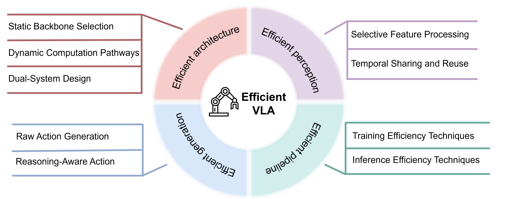

# Awesome-Efficient-VLA [](https://awesome.re)

[](https://arxiv.org/abs/2510.17111)
[](https://GitHub.com/Naereen/StrapDown.js/graphs/commit-activity)
[](http://makeapullrequest.com)

<p align="center">
  
</p>

This repository serves as a live collection of resources for our survey:
**[Efficient Vision-Language-Action Models for Embodied Manipulation: A Systematic Survey](https://arxiv.org/abs/2510.17111)**.

We’ve organized the current Efficient VLA landscape into a clear taxonomy to help researchers navigate the field more easily. This is a community-driven project — if you’ve authored or found a great paper that we missed, please open a PR or send me email! Let’s keep this list growing together.

---

## 📑 Table of Contents

* [1. Efficient Model Architecture](#efficient-model-architecture)
    * [Static Backbone Selection](#static-backbone-selection)
    * [Dynamic Computation Pathways](#dynamic-computation-pathways)
    * [Dual-system Design](#dual-system-design)
* [2. Efficient Perception Feature](#efficient-perception-feature)
    * [Selective Feature Processing](#selective-feature-processing)
    * [Temporal Sharing and Reuse](#temporal-sharing-and-reuse)
* [3. Efficient Action Generation](#efficient-action-generation)
    * [Raw Action Generation](#raw-action-generation)
    * [Reasoning-Aware Action Generation](#reasoning-aware-action-generation)
        * [Text Reasoning](#text-reasoning)
        * [Visual Reasoning](#visual-reasoning)
* [4. Efficient Training and Inference](#efficient-training-and-inference)
    * [Training Efficiency Techniques](#training-efficiency-techniques)
    * [Inference Efficiency Techniques](#inference-efficiency-techniques)
* [Citation](#citation)

---

## 📑 Efficient Model Architecture

Architecture choices set the efficiency ceiling — lighter backbones reduce latency and memory, dynamic paths keep capacity while pruning computation at runtime, and dual-system designs combine a slow reasoning core with a fast reactive module to trade off capability vs latency.

### Static Backbone Selection
> Use smaller / efficiency-tuned VLMs or compact LMs to cut inference cost; straightforward but limits peak capability.

| Paper / Method | Resources |
| :--- | :--- |
| RoboMamba: Efficient Vision-Language-Action Model for Robotic Reasoning and Manipulation | [[Paper]](https://arxiv.org/pdf/2406.04339) [[Project]](https://sites.google.com/view/robomamba-web) [[Code]](https://github.com/lmzpai/roboMamba) |
| TinyVLA: Towards Fast, Data-Efficient Vision-Language-Action Models for Robotic Manipulation | [[Paper]](https://arxiv.org/pdf/2409.12514) [[Project]](https://tiny-vla.github.io/) [[Code]](https://github.com/liyaxuanliyaxuan/TinyVLA) |
| SmolVLA: A vision-language-action model for affordable and efficient robotics | [[Paper]](https://arxiv.org/pdf/2506.01844) [[Project]](https://huggingface.co/blog/smolvla) |
| NORA: A SMALL OPEN-SOURCED GENERALIST VISION-LANGUAGE ACTION MODEL FOR EMBODIED TASKS | [[Paper]](https://arxiv.org/pdf/2504.19854) [[Project]](https://declare-lab.github.io/nora) [[Code]](https://github.com/declare-lab/nora) |
| EdgeVLA: Efficient Vision-Language-Action Models | [[Paper]](https://arxiv.org/pdf/2507.14049) |
| Evo-1: Lightweight Vision-Language-Action Model with Preserved Semantic Alignment | [[Paper]](https://arxiv.org/pdf/2511.04555) [[Code]](https://github.com/MINT-SJTU/Evo-1) |
| NANOVLA: ROUTING DECOUPLED VISION-LANGUAGE UNDERSTANDING FOR NANO-SIZED GENERALIST ROBOTIC POLICIES | [[Paper]](https://arxiv.org/pdf/2510.25122) |

### Dynamic Computation Pathways
> Keep large backbones for training but select or skip layers/tokens at inference (dynamic routing, early-exit, layer skipping) to reduce runtime cost while preserving capability.

| Paper / Method | Resources |
| :--- | :--- |
| FLOWER: Democratizing Generalist Robot Policies with Efficient Vision-Language-Action Flow Policies | [[Paper]](https://arxiv.org/pdf/2509.04996) [[Project]](https://intuitive-robots.github.io/flower_vla/) [[Code]](https://github.com/intuitive-robots/flower_vla_calvin) |
| DeeR-VLA: Dynamic Inference of Multimodal Large Language Models for Efficient Robot Execution | [[Paper]](https://arxiv.org/pdf/2411.02359) [[Code]](https://github.com/yueyang130/DeeR-VLA) |
| MoLe-VLA: Dynamic Layer-skipping Vision Language Action Model via Mixture-of-Layers for Efficient Robot Manipulation | [[Paper]](https://arxiv.org/pdf/2503.20384) [[Project]](https://sites.google.com/view/mole-vla) [[Code]](https://github.com/RoyZry98/MoLe-VLA-Pytorch/) |
| EfficientVLA: Training-Free Acceleration and Compression for Vision-Language-Action Models | [[Paper]](https://www.arxiv.org/pdf/2506.10100) |
| DeeAD: Dynamic Early Exit of Vision-Language Action for Efficient Autonomous Driving | [[Paper]](https://arxiv.org/pdf/2511.20720) |

### Dual-system Design
> Two cooperating modules — a **slow** high-capacity reasoning model and a **fast** lightweight reactive model — exchange summaries/latent tokens to balance planning and low-latency control.

| Paper / Method | Resources |
| :--- | :--- |
| From LLMs to Actions: Latent Codes as Bridges in Hierarchical Robot Control | [[Paper]](https://arxiv.org/pdf/2405.04798) |
| HiRT: Enhancing Robotic Control with Hierarchical Robot Transformers | [[Paper]](https://arxiv.org/pdf/2410.05273) |
| TOWARDS SYNERGISTIC, GENERALIZED AND EFFICIENT DUAL-SYSTEM FOR ROBOTIC MANIPULATION | [[Paper]](https://arxiv.org/pdf/2410.08001) [[Project]](https://robodual.github.io/) |
| OPENHELIX: A Short Survey, Empirical Analysis, and Open-Source Dual-System VLA Model for Robotic Manipulation | [[Paper]](https://arxiv.org/pdf/2505.03912) [[Project]](https://openhelix-robot.github.io/) [[Code]](https://github.com/OpenHelix-Team/OpenHelix) |
| Fast-in-Slow: A Dual-System Foundation Model Unifying Fast Manipulation within Slow Reasoning | [[Paper]](https://arxiv.org/pdf/2506.01953) [[Project]](https://fast-in-slow.github.io/) [[Code]](https://github.com/CHEN-H01/Fast-in-Slow) |
| Hume: Introducing System-2 Thinking in Visual-Language-Action Model | [[Paper]](https://arxiv.org/pdf/2505.21432) [[Project]](https://hume-vla.github.io/) [[Code]](https://github.com/hume-vla/hume) |
| ThinkAct: Vision-Language-Action Reasoning via Reinforced Visual Latent Planning | [[Paper]](https://arxiv.org/pdf/2507.16815) [[Project]](https://jasper0314-huang.github.io/thinkact-vla/) |
| MOTVLA: A VISION-LANGUAGE-ACTION MODEL WITH UNIFIED FAST-SLOW REASONING | [[Paper]](https://arxiv.org/pdf/2510.18337) [[Project]](https://motvla.github.io/MoTVLA-website/) |
| MEMER: SCALING UP MEMORY FOR ROBOT CONTROL VIA EXPERIENCE RETRIEVAL | [[Paper]](https://arxiv.org/pdf/2510.20328) [[Project]](https://jen-pan.github.io/memer/) |
| Video2Act: A Dual-System Video Diffusion Policy with Robotic Spatio-Motional Modeling | [[Paper]](https://arxiv.org/pdf/2512.03044) [[Project]](https://video2act.github.io/) [[Code]](https://github.com/jiayueru/Video2Act) |

---

## 📑 Efficient Perception Feature

Visual tokens dominate compute; reduce token length and redundancy via selective processing (pruning/compression) and temporal reuse across frames to cut runtime without losing task-critical signals.

### Selective Feature Processing
> Compress or prune image tokens before feeding the policy to preserve only task-relevant features.

| Paper / Method | Resources |
| :--- | :--- |
| EfficientVLA: Training-Free Acceleration and Compression for Vision-Language-Action Models | [[Paper]](https://www.arxiv.org/pdf/2506.10100) |
| SP-VLA: A joint model scheduling and token-pruning approach for VLA model acceleration | [[Paper]](https://arxiv.org/pdf/2506.12723) |
| Think Twice, Act Once: Token-Aware Compression and Action Reuse for Efficient Inference in VLA Models | [[Paper]](https://arxiv.org/pdf/2505.21200) |
| The Better You Learn, The Smarter You Prune: Differentiable Token Pruning for VLA | [[Paper]](https://arxiv.org/pdf/2509.12594) [[Project]](https://liauto-research.github.io/LightVLA/) [[Code]](https://github.com/LiAutoAD/LightVLA) |
| ACTION-AWARE DYNAMIC PRUNING FOR EFFICIENT VISION-LANGUAGE-ACTION MANIPULATION | [[Paper]](https://arxiv.org/pdf/2509.22093) |
| FastDriveVLA: Efficient End-to-End Driving via Plug-and-Play Reconstruction-based Token Pruning | [[Paper]](https://arxiv.org/pdf/2507.23318) |
| SpecPrune-VLA: Accelerating VLA Models via Action-Aware Self-Speculative Pruning | [[Paper]](https://arxiv.org/pdf/2509.05614) |
| SQAP-VLA: A Synergistic Quantization-Aware Pruning Framework | [[Paper]](https://arxiv.org/pdf/2509.09090) |
| OTTER: A Vision-Language-Action Model with Text-Aware Visual Feature Extraction | [[Paper]](https://arxiv.org/pdf/2503.03734) [[Project]](https://ottervla.github.io/) [[Code]](https://github.com/Max-Fu/otter) |
| Unified Vision-Language-Action Model | [[Paper]](https://arxiv.org/pdf/2506.19850) [[Project]](https://robertwyq.github.io/univla.github.io/) [[Code]](https://github.com/baaivision/UniVLA) |
| SemanticVLA: Semantic-Aligned Sparsification and Enhancement for Efficient Robotic Manipulation | [[Paper]](https://arxiv.org/pdf/2511.10518) |
| VLA-Pruner: Temporal-Aware Dual-Level Visual Token Pruning for Efficient Vision-Language-Action Inference | [[Paper]](https://arxiv.org/pdf/2511.16449) |
| COMPRESSOR-VLA: INSTRUCTION-GUIDED VISUAL TOKEN COMPRESSION FOR EFFICIENT ROBOTIC MANIPULATION | [[Paper]](https://arxiv.org/pdf/2511.18950) |
| Token Expand-Merge: Training-Free Token Compression for Vision-Language-Action Models | [[Paper]](https://arxiv.org/pdf/2512.09927) |

### Temporal Sharing and Reuse
> Reuse stable features across nearby timesteps to avoid recomputing unchanged content and save latency.

| Paper / Method | Resources |
| :--- | :--- |
| VLA-Cache: Efficient Vision-Language-Action Manipulation via Adaptive Token Caching | [[Paper]](https://arxiv.org/pdf/2502.02175) [[Project]](https://vla-cache.github.io/) [[Code]](https://github.com/siyuhsu/vla-cache) |
| TTF-VLA: Temporal Token Fusion via Pixel-Attention Integration for VLA Models | [[Paper]](https://arxiv.org/pdf/2508.19257) |
| Think Twice, Act Once: Token-Aware Compression and Action Reuse for Efficient Inference in VLA Models | [[Paper]](https://arxiv.org/pdf/2505.21200) |
| EfficientVLA: Training-Free Acceleration and Compression for VLA Models | [[Paper]](https://www.arxiv.org/pdf/2506.10100) |
| Robotic Control via Embodied Chain-of-Thought Reasoning | [[Paper]](https://arxiv.org/pdf/2407.08693) [[Project]](https://embodied-cot.github.io/) [[Code]](https://github.com/MichalZawalski/embodied-CoT/) |
| Fast ECoT: Efficient Embodied Chain-of-Thought via Thoughts Reuse | [[Paper]](https://arxiv.org/pdf/2506.07639) |
| KV-Efficient VLA: A Method of Speed up Vision Language Model with RNN-Gated Chunked KV Cache | [[Paper]](https://arxiv.org/pdf/2509.21354) |
| RetoVLA: Reusing Register Tokens for Spatial Reasoning in Vision-Language-Action Models | [[Paper]](https://arxiv.org/pdf/2509.21243) [[Project]](https://www.youtube.com/watch?v=2CseBR-snZg) |
| ExpReS-VLA: Specializing Vision-Language-Action Models Through Experience Replay and Retrieval | [[Paper]](https://arxiv.org/pdf/2511.06202) |

---

## 📑 Efficient Action Generation

Action design affects precision and latency. Choices range from raw low-dim continuous outputs (fast but drift-prone) to action tokenization and intermediate reasoning (better planning, higher latency). Balance is key.

### Raw Action Generation
> Directly predict low-dimensional actions (e.g., 7D) for low-latency control; efficient but limited for long-horizon planning.

| Paper / Method | Resources |
| :--- | :--- |
| Learning Fine-Grained Bimanual Manipulation with Low-Cost Hardware | [[Paper]](https://arxiv.org/pdf/2304.13705) [[Project]](https://tonyzhaozh.github.io/aloha/) [[Code]](https://github.com/tonyzhaozh/aloha) |
| Real-Time Execution of Action Chunking Flow Policies | [[Paper]](https://arxiv.org/pdf/2506.07339) [[Project]](https://www.pi.website/research/real_time_chunking) |
| FAST: Efficient Action Tokenization for Vision-Language-Action Models | [[Paper]](https://arxiv.org/pdf/2501.09747) [[Project]](https://www.pi.website/research/fast) |
| OMNISAT: COMPACT ACTION TOKEN, FASTER AUTOREGRESSION | [[Paper]](https://arxiv.org/pdf/2510.09667) [[Project]](https://annoymoushh.github.io/) |
| VOTE: Vision-Language-Action Optimization with Trajectory Ensemble Voting | [[Paper]](https://arxiv.org/pdf/2507.05116) [[Code]](https://github.com/LukeLIN-web/VOTE) |
| SpatialVLA: Exploring Spatial Representations for Visual-Language-Action Model | [[Paper]](https://arxiv.org/pdf/2501.15830) [[Project]](https://spatialvla.github.io/) [[Code]](https://github.com/SpatialVLA/SpatialVLA) |
| NANOVLA: ROUTING DECOUPLED VISION-LANGUAGE UNDERSTANDING FOR NANO-SIZED GENERALIST ROBOTIC POLICIES | [[Paper]](https://arxiv.org/pdf/2510.25122) |
| AsyncVLA: Asynchronous Flow Matching for Vision-Language-Action Models | [[Paper]](https://arxiv.org/pdf/2511.14148) [[Code]](https://github.com/YuhuaJiang2002/AsyncVLA) |

### Reasoning-Aware Action Generation
> Insert intermediate reasoning (text/vision) before actions — improves planning and interpretability but adds latency; useful for long-horizon tasks.

#### Text Reasoning
| Paper / Method | Resources |
| :--- | :--- |
| Robotic Control via Embodied Chain-of-Thought Reasoning | [[Paper]](https://arxiv.org/pdf/2407.08693) [[Project]](https://embodied-cot.github.io/) [[Code]](https://github.com/MichalZawalski/embodied-CoT/) |
| Efficient Embodied Chain-of-Thought via Thoughts Reuse | [[Paper]](https://arxiv.org/pdf/2506.07639) |
| Training Strategies for Efficient Embodied Reasoning | [[Paper]](https://arxiv.org/pdf/2505.08243) [[Project]](https://ecot-lite.github.io/) |
| Latent Chain-of-Thought World Modeling for End-to-End Autonomous Driving | [[Paper]](https://arxiv.org/pdf/2512.10226) |

#### Visual Reasoning
| Paper / Method | Resources |
| :--- | :--- |
| Zero-shot Robotic Manipulation with Pretrained Image-Editing Diffusion Models | [[Paper]](https://arxiv.org/pdf/2310.10639) [[Project]](https://rail-berkeley.github.io/susie/) [[Code]](https://github.com/kvablack/susie) |
| Video Prediction Policy: A Generalist Robot Policy with Predictive Visual Representations | [[Paper]](https://arxiv.org/pdf/2412.14803) [[Project]](https://video-prediction-policy.github.io/) [[Code]](https://github.com/roboterax/video-prediction-policy) |
| CoT-VLA: Visual Chain-of-Thought Reasoning for Vision-Language-Action Models | [[Paper]](https://arxiv.org/pdf/2503.22020) [[Project]](https://cot-vla.github.io/) |
| DreamVLA: A Vision-Language-Action Model Dreamed with Comprehensive World Knowledge | [[Paper]](https://arxiv.org/pdf/2507.04447) [[Project]](https://zhangwenyao1.github.io/DreamVLA/) [[Code]](https://github.com/Zhangwenyao1/DreamVLA) |
| PIXELVLA: ADVANCING PIXEL-LEVEL UNDERSTANDING IN VISION-LANGUAGE-ACTION MODEL | [[Paper]](https://arxiv.org/pdf/2511.01571) |
| MM-ACT: Learn from Multimodal Parallel Generation to Act | [[Paper]](https://arxiv.org/pdf/2512.00975) [[Code]](https://github.com/HHYHRHY/MM-ACT) |

---

## 📑 Efficient Training and Inference

Beyond model/representation, practical deployment needs efficiency during training and inference: parameter-efficient fine-tuning, distillation, pruning, quantization, and parallel decoding are widely used.

### Training Efficiency Techniques
> Reduce adaptation cost with parameter-efficient tuning, distillation, and aggressive quantization/pruning that retain performance.

| Paper / Method | Resources |
| :--- | :--- |
| TinyVLA: Fast, Data-Efficient VLA Models | [[Paper]](https://arxiv.org/pdf/2409.12514) [[Project]](https://tiny-vla.github.io/) [[Code]](https://github.com/liyaxuanliyaxuan/TinyVLA) |
| CEED-VLA: Consistency Vision-Language-Action Model with Early-Exit Decoding | [[Paper]](https://arxiv.org/pdf/2506.13725) [[Project]](https://irpn-eai.github.io/CEED-VLA/) [[Code]](https://github.com/OpenHelix-Team/CEED-VLA) |
| MoLe-VLA: Dynamic Layer-skipping via Mixture-of-Layers | [[Paper]](https://arxiv.org/pdf/2503.20384) [[Project]](https://sites.google.com/view/mole-vla) [[Code]](https://github.com/RoyZry98/MoLe-VLA-Pytorch/) |
| VITA-VLA: Efficiently Teaching Vision-Language Models to Act via Action Expert Distillation | [[Paper]](https://arxiv.org/pdf/2510.09607) [[Project]](https://ltbai.github.io/VITA-VLA/) [[Code]](https://github.com/Tencent/VITA/tree/VITA-VLA) |
| Don’t Run with Scissors: Pruning Breaks VLA Models but They Can Be Recovered | [[Paper]](https://arxiv.org/pdf/2510.08464) [[Project]](https://gluestick-vla.github.io/) |
| Saliency-Aware Quantized Imitation Learning for Efficient Robotic Control | [[Paper]](https://arxiv.org/pdf/2505.15304) |
| BitVLA: 1-bit Vision-Language-Action Models for Robotics Manipulation | [[Paper]](https://arxiv.org/pdf/2506.07530) [[Code]](https://github.com/ustcwhy/BitVLA) |
| NinA: Normalizing Flows in Action. Training VLA Models with Normalizing Flows | [[Paper]](https://arxiv.org/pdf/2508.16845) [[Code]](https://github.com/dunnolab/NinA/) |
| FT-NCFM: An Influence-Aware Data Distillation Framework for Efficient VLA Models | [[Paper]](https://arxiv.org/pdf/2511.16233) |
| ActDistill: General Action-Guided Self-Derived Distillation for Efficient Vision-Language-Action Models | [[Paper]](https://arxiv.org/pdf/2511.18082) [[Code]](https://github.com/gooogleshanghai/ActDistill) |
| FASTER: TOWARD EFFICIENT AUTOREGRESSIVE VISION LANGUAGE ACTION MODELING VIA NEURAL ACTION TOKENIZATION | [[Paper]](https://arxiv.org/pdf/2512.04952)|

### Inference Efficiency Techniques
> Move beyond autoregressive decoding — use early-exit, speculative, parallel or chunked decoding to reduce latency in time-critical control loops.

| Paper / Method | Resources |
| :--- | :--- |
| Fine-Tuning VLA Models: Optimizing Speed and Success | [[Paper]](https://arxiv.org/pdf/2502.19645) [[Project]](https://openvla-oft.github.io/) [[Code]](https://github.com/moojink/openvla-oft) |
| Spec-VLA: Speculative Decoding for Vision-Language-Action Models with Relaxed Acceptance | [[Paper]](https://arxiv.org/pdf/2507.22424) [[Code]](https://github.com/PineTreeWss/SpecVLA) |
| Accelerating VLA Models Integrated with Action Chunking via Parallel Decoding | [[Paper]](https://arxiv.org/pdf/2503.02310) |
| CEED-VLA: Consistency VLA with Early-Exit Decoding | [[Paper]](https://arxiv.org/pdf/2506.13725) [[Project]](https://irpn-eai.github.io/CEED-VLA/) [[Code]](https://github.com/OpenHelix-Team/CEED-VLA) |
| DISCRETE DIFFUSION VLA: BRINGING DISCRETE DIFFUSION TO ACTION DECODING IN VISION-LANGUAGE-ACTION POLICIES | [[Paper]](https://arxiv.org/pdf/2508.20072) |
| UNIFIED DIFFUSION VLA: VISION-LANGUAGE-ACTION MODEL VIA JOINT DISCRETE DENOISING DIFFUSION PROCESS | [[Paper]](https://arxiv.org/pdf/2511.01718) [[Project]](https://irpn-eai.github.io/UD-VLA.github.io/) [[Code]](https://github.com/OpenHelix-Team/UD-VLA/tree/main) |

---

## 📑 Citation

If you find this survey or resource list helpful, please consider citing our work:

```bibtex
@misc{guan2025efficientvisionlanguageactionmodelsembodied,
      title={Efficient Vision-Language-Action Models for Embodied Manipulation: A Systematic Survey}, 
      author={Weifan Guan and Qinghao Hu and Aosheng Li and Jian Cheng},
      year={2025},
      eprint={2510.17111},
      archivePrefix={arXiv},
      primaryClass={cs.RO},
      url={[https://arxiv.org/abs/2510.17111](https://arxiv.org/abs/2510.17111)}

}
```
## Star History

[](#fig:starhistory)

