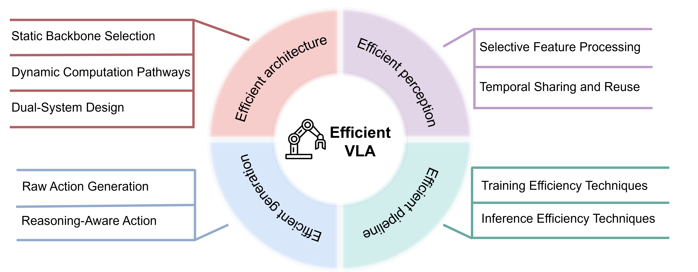

# Awesome-Efficient-VLA [](https://awesome.re)

[](https://arxiv.org/pdf/2510.17111)
[](https://github.com/guanweifan/awesome-efficient-vla/commits/main/)
[](https://github.com/guanweifan/awesome-efficient-vla/pulls)

<p align="center">
  
</p>

📖 Survey: A live-updated hub for **[Efficient VLA for Embodied Manipulation](https://arxiv.org/pdf/2510.17111)** across architecture, perception, action & pipeline, providing real-time updates on the fast-moving VLA field.

🚀 Updates: Weekly / Bi-weekly. Contributions & ⭐ are welcome to help researchers navigate the field!

---

## 🔥 Latest Updates (2026-03-23 to 2026-03-30)

- **Perception:** [VLA-IAP](#selective-feature-processing)
- **Action:** [Fast-dVLA](#raw-action-generation)
- **Reasoning:** [DualCoT-VLA](#reasoning-aware-action-generation)

See the full list in the corresponding sections below.

---

## 🧭 Table of Contents
* [Related Surveys](#related-surveys)
* [Paper List by Taxonomy](#paper-list-by-taxonomy)
    * [1. Efficient Model Architecture](#efficient-model-architecture)
        * [1.1 Static Backbone Selection](#static-backbone-selection)
        * [1.2 Dynamic Computation Pathways](#dynamic-computation-pathways)
        * [1.3 Dual-system Design](#dual-system-design)
    * [2. Efficient Perception Feature](#efficient-perception-feature)
        * [2.1 Selective Feature Processing](#selective-feature-processing)
        * [2.2 Temporal Sharing and Reuse](#temporal-sharing-and-reuse)
    * [3. Efficient Action Generation](#efficient-action-generation)
        * [3.1 Raw Action Generation](#raw-action-generation)
        * [3.2 Reasoning-Aware Action Generation](#reasoning-aware-action-generation)
    * [4. Efficient Training and Inference](#efficient-training-and-inference)
        * [4.1 Training Efficiency Techniques](#training-efficiency-techniques)
        * [4.2 Inference Efficiency Techniques](#inference-efficiency-techniques)
* [Citation](#citation)
* [Star History](#star-history)
* [Appendix: Classification Logic](#appendix)

---

<a id="related-surveys"></a>
## 📚 Related Surveys

- **[EFFICIENT VISION-LANGUAGE-ACTION MODELS FOR EMBODIED MANIPULATION: A SYSTEMATIC SURVEY](https://arxiv.org/pdf/2510.17111)** *(This work)*
- **[A Survey on Efficient Vision-Language-Action Models](https://arxiv.org/pdf/2510.24795)**

---

<a id="paper-list-by-taxonomy"></a>
## 🗂️ Paper List by Taxonomy

The following sections organize papers by their primary efficiency mechanism.

> **Tag Notes**
> - `Secondary`: this paper is also relevant to another taxonomy category.
> - `Domain: AD (Autonomous Driving)`: this paper targets driving scenarios, included for transferable efficiency methods.
> - `Domain: VLN (Vision-Language-Navigation)`: this paper targets vision-language navigation, included for transferable efficiency methods.

<a id="efficient-model-architecture"></a>
## 🏗️ Efficient Model Architecture

Reduce structural redundancy inside the model itself.
This category modifies the computation graph or module organization of VLA models to lower capacity redundancy — either by shrinking the backbone, dynamically adapting depth, or splitting reasoning and control into separate systems.

<a id="static-backbone-selection"></a>
## 🦴 1.1 Static Backbone Selection
> Lower the baseline cost by adopting smaller or efficiency-oriented backbones.
The model structure is fixed and lightweight by design, reducing latency and memory at all timesteps without runtime adaptation. The trade-off is reduced peak capacity on complex tasks.

- [**Evo-1: Lightweight Vision-Language-Action Model with Preserved Semantic Alignment**](https://arxiv.org/pdf/2511.04555) [](https://github.com/MINT-SJTU/Evo-1)

  (`2025-11`) Compact multimodal backbone with a cross-modulated diffusion transformer. <sub>Sec. 4.1</sub>

- [**FLOWER: Democratizing Generalist Robot Policies with Efficient Vision-Language-Action Flow Policies**](https://arxiv.org/pdf/2509.04996) [](https://github.com/intuitive-robots/flower_vla_calvin) []()

  (`2025-09`) Intermediate-modality fusion with LLM layer pruning.

- [**SmolVLA: A vision-language-action model for affordable and efficient robotics**](https://arxiv.org/pdf/2506.01844) [](https://github.com/huggingface/lerobot)

  (`2025-06`) Single-GPU training with asynchronous inference. <sub>Sec. 4.2</sub>

- [**NORA: A SMALL OPEN-SOURCED GENERALIST VISION-LANGUAGE ACTION MODEL FOR EMBODIED TASKS**](https://arxiv.org/pdf/2504.19854) [](https://github.com/declare-lab/nora)

  (`2025-04`) Qwen-2.5-VL-3B backbone with a FAST+ tokenizer.

- [**TinyVLA: Towards Fast, Data-Efficient Vision-Language-Action Models for Robotic Manipulation**](https://arxiv.org/pdf/2409.12514) [](https://github.com/liyaxuanliyaxuan/TinyVLA) []()

  (`2024-09`) High-speed multimodal backbone with a diffusion policy decoder. <sub>Sec. 4.1</sub>

- [**RoboMamba: Efficient Vision-Language-Action Model for Robotic Reasoning and Manipulation**](https://arxiv.org/pdf/2406.04339) [](https://github.com/lmzpai/roboMamba) []()

  (`2024-06`) Mamba state-space backbone for linear-complexity reasoning and efficient inference. <sub>Sec. 4.1</sub>

<a id="dynamic-computation-pathways"></a>
## 🔀 1.2 Dynamic Computation Pathways
> Retain a large-capacity backbone but reduce runtime cost by dynamically selecting computation paths.
Methods in this category introduce layer skipping, routing, or built-in early-exit mechanisms that adapt depth or module usage conditioned on input difficulty.

- [**Act, Think or Abstain: Complexity-Aware Adaptive Inference for Vision-Language-Action Models (ActThinkAbstain)**](https://arxiv.org/pdf/2603.05147)

  (`2026-03`) Adaptive routing between direct acting, deeper reasoning, and abstention based on task complexity.

- [**DySL-VLA: Efficient Vision-Language-Action Model Inference via Dynamic-Static Layer-Skipping for Robot Manipulation**](https://arxiv.org/pdf/2602.22896) [](https://github.com/PKU-SEC-Lab/DYSL_VLA)

  (`2026-02`) Dynamic-static layer skipping that prioritizes action-critical layers during inference. <sub>Sec. 4.1</sub>

- [**Environment-Aware Adaptive Pruning with Interleaved Inference Orchestration for Vision-Language-Action Models (EcoVLA)**](https://arxiv.org/pdf/2602.00780)

  (`2026-02`) Environment-aware adaptive channel pruning with interleaved orchestration. <sub>Sec. 4.2</sub>

- [**NANOVLA: ROUTING DECOUPLED VISION-LANGUAGE UNDERSTANDING FOR NANO-SIZED GENERALIST ROBOTIC POLICIES**](https://arxiv.org/pdf/2510.25122)

  (`2025-10`) Lightweight VLA with dynamic routing. <sub>Sec. 1.2</sub>

- [**MoLe-VLA: Dynamic Layer-skipping Vision Language Action Model via Mixture-of-Layers for Efficient Robot Manipulation**](https://arxiv.org/pdf/2503.20384) [](https://github.com/RoyZry98/MoLe-VLA-Pytorch) []()

  (`2025-03`) Mixture-of-Layers VLA with a spatial-temporal router for dynamic LLM layer activation.

- [**DeeR-VLA: Dynamic Inference of Multimodal Large Language Models for Efficient Robot Execution**](https://arxiv.org/pdf/2411.02359) [](https://github.com/yueyang130/DeeR-VLA) []()

  (`2024-11`) Multi-exit MLLM-based VLA with resource-aware early termination. <sub>Sec. 4.2</sub>

<a id="dual-system-design"></a>
## ⚖️ 1.3 Dual-system Design
> Decompose the VLA policy into two cooperating modules operating at different frequencies.
A slow, high-capacity reasoning component provides guidance to a fast, lightweight reactive controller, balancing deliberation and real-time execution.

- [**TacMamba: A Tactile History Compression Adapter Bridging Fast Reflexes and Slow VLA Reasoning**](https://arxiv.org/pdf/2603.01700)

  (`2026-03`) Tactile history compression that aligns high-frequency tactile control with slower visual reasoning.

- [**StreamVLA: Breaking the Reason-Act Cycle via Completion-State Gating**](https://arxiv.org/pdf/2602.01100)

  (`2026-02`) Lock-and-gated selective slow reasoning. <sub>Sec. 4.2</sub>

- [**Video2Act: A Dual-System Video Diffusion Policy with Robotic Spatio-Motional Modeling**](https://arxiv.org/pdf/2512.03044) [](https://github.com/jiayueru/Video2Act)

  (`2025-12`) Dual-system VLA with slow VDM reasoning.

- [**MEMER: SCALING UP MEMORY FOR ROBOT CONTROL VIA EXPERIENCE RETRIEVAL**](https://arxiv.org/pdf/2510.20328) []()

  (`2025-10`) Memory-aware high-level policy selecting relevant keyframes to guide low-level execution. <sub>Sec. 2.2</sub>

- [**MOTVLA: A VISION-LANGUAGE-ACTION MODEL WITH UNIFIED FAST-SLOW REASONING**](https://arxiv.org/pdf/2510.18337)

  (`2025-10`) Mixture-of-Transformers VLA with unified fast-slow reasoning.

- [**Fast-in-Slow: A Dual-System Foundation Model Unifying Fast Manipulation within Slow Reasoning (FiS-VLA)**](https://arxiv.org/pdf/2506.01953) [](https://github.com/CHEN-H01/Fast-in-Slow) []()

  (`2025-06`) Fast execution module within VLM-based reasoning model.

- [**Hume: Introducing System-2 Thinking in Visual-Language-Action Model**](https://arxiv.org/pdf/2505.21432) [](https://github.com/hume-vla/hume)

  (`2025-05`) Value-guided slow thinking with lightweight reactive action denoising.

- [**OPENHELIX: A Short Survey, Empirical Analysis, and Open-Source Dual-System VLA Model for Robotic Manipulation**](https://arxiv.org/pdf/2505.03912) [](https://github.com/OpenHelix-Team/OpenHelix)

  (`2025-05`) Systematic structural evaluation with a low-cost design.

- [**TOWARDS SYNERGISTIC, GENERALIZED AND EFFICIENT DUAL-SYSTEM FOR ROBOTIC MANIPULATION**](https://arxiv.org/pdf/2410.08001)

  (`2024-10`) Generalist reasoning with a lightweight specialist diffusion policy.

- [**HiRT: Enhancing Robotic Control with Hierarchical Robot Transformers**](https://arxiv.org/pdf/2410.05273) []()

  (`2024-10`) Low-frequency VLM reasoning with a high-frequency vision-based control policy.

---

<a id="efficient-perception-feature"></a>
## 📷 Efficient Perception Feature

Reduce spatial and temporal redundancy in visual representations.
Since visual tokens dominate attention cost and KV memory, this category focuses on shrinking, filtering, or reusing perceptual features without modifying the core model architecture.

<a id="selective-feature-processing"></a>
## ✂️ 2.1 Selective Feature Processing
> Compress or prune visual tokens before they are consumed by the policy.
Methods selectively retain task-relevant spatial information (foreground, geometry, semantics) to reduce attention cost while preserving critical signals.

- [**VLA-IAP: Training-Free Visual Token Pruning via Interaction Alignment for Vision-Language-Action Models**](https://arxiv.org/pdf/2603.22991)

  🔥 New (`2026-03`) Training-free visual token pruning that preserves geometric interaction anchors and dynamically schedules pruning intensity using semantic-motion alignment.

- [**BFA++: Hierarchical Best-Feature-Aware Token Prune for Multi-View Vision Language Action Model**](https://arxiv.org/pdf/2602.20566)

  (`2026-02`) Hierarchical multi-view token pruning that removes redundant regions and camera views.

- [**Think Proprioceptively: Embodied Visual Reasoning for VLA Manipulation (ThinkProprio)**](https://arxiv.org/pdf/2602.06575)

  (`2026-02`) Early proprioception fusion for aggressive visual token reduction.

- [**DTP:A SIMPLE YET EFFECTIVE DISTRACTING TOKEN PRUNINGFRAMEWORK FOR VISION-LANGUAGE ACTION MODELS**](https://arxiv.org/pdf/2601.16065)

  (`2026-01`) Distracting token pruning to remove task-irrelevant visual tokens. <sub>[Code](https://anonymous.4open.science/r/CBD3)</sub>

- [**Token Expand-Merge: Training-Free Token Compression for Vision-Language-Action Models (TEAM-VLA)**](https://arxiv.org/pdf/2512.09927) [](https://github.com/Jasper-aaa/TEAM-VLA)

  (`2025-12`) Dynamic token expansion and merging.

- [**COMPRESSOR-VLA: INSTRUCTION-GUIDED VISUAL TOKEN COMPRESSION FOR EFFICIENT ROBOTIC MANIPULATION**](https://arxiv.org/pdf/2511.18950)

  (`2025-11`) Hybrid visual token compression with semantic distillation.

- [**VLA-Pruner: Temporal-Aware Dual-Level Visual Token Pruning for Efficient Vision-Language-Action Inference**](https://arxiv.org/pdf/2511.16449) [](https://github.com/MINT-SJTU/VLA-Pruner)

  (`2025-11`) Dual-objective visual token pruning aligned with semantic understanding.

- [**SemanticVLA: Semantic-Aligned Sparsification and Enhancement for Efficient Robotic Manipulation**](https://arxiv.org/pdf/2511.10518) [](https://github.com/JiuTian-VL/SemanticVLA) []()

  (`2025-11`) Dual visual pruning with hierarchical fusion for sparsified VLA perception.

- [**ACTION-AWARE DYNAMIC PRUNING FOR EFFICIENT VISION-LANGUAGE-ACTION MANIPULATION**](https://arxiv.org/pdf/2509.22093) []()

  (`2025-09`) Action-aware dynamic visual token pruning with trajectory-conditioned gating.

- [**The Better You Learn, The Smarter You Prune: Differentiable Token Pruning for VLA**](https://arxiv.org/pdf/2509.12594) [](https://github.com/LiAutoAD/LightVLA)

  (`2025-09`) Adaptive visual token pruning via dynamic query-based importance estimation.

- [**SpecPrune-VLA: Accelerating VLA Models via Action-Aware Self-Speculative Pruning**](https://arxiv.org/pdf/2509.05614)

  (`2025-09`) Spatial-temporally consistent two-level visual token pruning with action-aware control.

- [**FastDriveVLA: Efficient End-to-End Driving via Plug-and-Play Reconstruction-based Token Pruning**](https://arxiv.org/pdf/2507.23318)

  (`2025-07`) Reconstruction-based foreground-aware visual token pruning. <sub>AD</sub>

- [**Think Twice, Act Once: Token-Aware Compression and Action Reuse for Efficient Inference in VLA Models (FlashVLA)**](https://arxiv.org/pdf/2505.21200)

  (`2025-05`) Action reuse with information-guided visual token pruning. <sub>Sec. 2.2</sub>

<a id="temporal-sharing-and-reuse"></a>
## ♻️ 2.2 Temporal Sharing and Reuse
> Exploit temporal consistency to avoid recomputing stable information across timesteps.
This includes feature fusion, KV reuse/compression, or temporal token caching mechanisms that reduce redundant computation in sequential decision-making.

- [**Beyond Short-Horizon: VQ-Memory for Robust Long-Horizon Manipulation in Non-Markovian Simulation Benchmarks (VQ-Memory)**](https://arxiv.org/pdf/2603.09513)

  (`2026-03`) Vector-quantized memory that compresses long-horizon proprioceptive histories into discrete latent tokens for efficient temporal context modeling.

- [**History-Conditioned Spatio-Temporal Visual Token Pruning for Efficient Vision-Language Navigation (A-MMR)**](https://arxiv.org/pdf/2603.06480)

  (`2026-03`) Training-free spatio-temporal token pruning for current views and navigation history. <sub>Sec. 2.1 · VLN</sub>

- [**FUTURE-VLA: Forecasting Unified Trajectories Under Real-time Execution**](https://arxiv.org/pdf/2602.15882) [](https://github.com/fan-jj24/FUTURE-VLA)

  (`2026-02`) Temporally adaptive compression for long multi-view histories with constant-latency execution.

- [**Efficient Long-Horizon Vision-Language-Action Models via Static-Dynamic Disentanglement**](https://arxiv.org/pdf/2602.03983)

  (`2026-02`) Static-dynamic token disentanglement with KV reuse.

- [**Learning to Accelerate Vision-Language-Action Models through Adaptive Visual Token Caching**](https://arxiv.org/pdf/2602.00500) [](https://github.com/JiahanFan/LAC)

  (`2026-02`) Task-aware token caching with differentiable selection. <sub>Sec. 4.2</sub>

- [**KV-Efficient VLA: A Method of Speed up Vision Language Model with RNN-Gated Chunked KV Cache**](https://arxiv.org/pdf/2509.21354)

  (`2025-09`) Chunk-based KV cache compression with recurrent utility gating.

- [**VLA-Cache: Efficient Vision-Language-Action Manipulation via Adaptive Token Caching**](https://arxiv.org/pdf/2502.02175) [](https://github.com/siyuhsu/vla-cache) []()

  (`2025-02`) Visual token KV caching and reuse.

---

<a id="efficient-action-generation"></a>
## 🤖 Efficient Action Generation

Reduce redundancy in action modeling.
Instead of modifying perception or architecture, this category focuses on how actions are represented, generated, or reasoned about — affecting latency, planning quality, and output dimensionality.

<a id="raw-action-generation"></a>
## 🕹️ 3.1 Raw Action Generation
> Improve efficiency by redesigning action representation or decoding mechanisms without inserting explicit reasoning steps.
This includes action tokenizers, discrete/flow-based decoders, block-wise or parallel decoding for actions, and compact action parameterizations.

- [**Fast-dVLA: Accelerating Discrete Diffusion VLA to Real-Time Performance**](https://arxiv.org/pdf/2603.25661)

  🔥 New (`2026-03`) Block-wise discrete diffusion action generation with KV-cache reuse and inter-block parallel decoding for real-time VLA inference. <sub>Sec. 4.2</sub>

- [**FASTER: Rethinking Real-Time Flow VLAs**](https://arxiv.org/pdf/2603.19199)

  (`2026-03`) Horizon-aware flow action sampling that compresses immediate reaction decoding into a single step while preserving long-horizon trajectory quality. <sub>Sec. 4.2</sub>

- [**ProbeFlow: Training-Free Adaptive Flow Matching for Vision-Language-Action Models**](https://arxiv.org/pdf/2603.17850)

  (`2026-03`) Training-free adaptive flow solver that dynamically schedules ODE integration steps to prune redundant decoding evaluations in flow-based VLA action heads.

- [**Unifying Language-Action Understanding and Generation for Autonomous Driving (LinkVLA)**](https://arxiv.org/pdf/2603.01441)

  (`2026-03`) Unified language-action codebook with coarse-to-fine decoding for efficient driving control. <sub>AD</sub>

- [**Global Prior Meets Local Consistency: Dual-Memory Augmented Vision-Language-Action Model for Efficient Robotic Manipulation (OptimusVLA)**](https://arxiv.org/pdf/2602.20200)

  (`2026-02`) Dual-memory generative policy that shortens the denoising path with retrieved task-level action priors.

- [**ActionCodec: What Makes for Good Action Tokenizers**](https://arxiv.org/pdf/2602.15397)

  (`2026-02`) Optimization-oriented action tokenizer that improves temporal overlap and vocabulary efficiency.

- [**Recurrent-Depth VLA: Implicit Test-Time Compute Scaling of Vision-Language-Action Models via Latent Iterative Reasoning (RD-VLA)**](https://arxiv.org/pdf/2602.07845) [](https://github.com/rd-vla/rd-vla)

  (`2026-02`) Recurrent latent refinement with adaptive stopping for compute-aware VLA inference. <sub>Sec. 1.2</sub>

- [**FASTER: TOWARD EFFICIENT AUTOREGRESSIVE VISION LANGUAGE ACTION MODELING VIA NEURAL ACTION TOKENIZATION**](https://arxiv.org/pdf/2512.04952) []()

  (`2025-12`) High-compression action tokenizer with block-wise autoregressive decoding.

- [**MM-ACT: Learn from Multimodal Parallel Generation to Act**](https://arxiv.org/pdf/2512.00975) [](https://github.com/HHYHRHY/MM-ACT)

  (`2025-12`) Parallel action decoding. <sub>Sec. 4.2</sub>

- [**AsyncVLA: Asynchronous Flow Matching for Vision-Language-Action Models**](https://arxiv.org/pdf/2511.14148) [](https://github.com/YuhuaJiang2002/AsyncVLA)

  (`2025-11`) Flow matching with action-aware non-uniform scheduling.

- [**UNIFIED DIFFUSION VLA: VISION-LANGUAGE-ACTION MODEL VIA JOINT DISCRETE DENOISING DIFFUSION PROCESS**](https://arxiv.org/pdf/2511.01718) [](https://github.com/OpenHelix-Team/UD-VLA) []()

  (`2025-11`) Joint diffusion denoising for synchronous image-action generation.

- [**OMNISAT: COMPACT ACTION TOKEN, FASTER AUTOREGRESSION**](https://arxiv.org/pdf/2510.09667)

  (`2025-10`) Residual-quantized action tokenizer (OmniSAT) for shortening autoregressive VLA action sequences.

- [**DISCRETE DIFFUSION VLA: BRINGING DISCRETE DIFFUSION TO ACTION DECODING IN VISION-LANGUAGE-ACTION POLICIES**](https://arxiv.org/pdf/2508.20072)

  (`2025-08`) Discrete diffusion decoder with adaptive parallel refinement.

- [**NinA: Normalizing Flows in Action. Training VLA Models with Normalizing Flows**](https://arxiv.org/pdf/2508.16845) [](https://github.com/dunnolab/NinA)

  (`2025-08`) Action decoder enabling one-shot sampling for fast VLA inference.

- [**EdgeVLA: Efficient Vision-Language-Action Models**](https://arxiv.org/pdf/2507.14049) [](https://github.com/kscalelabs/evla)

  (`2025-07`) End-effector prediction with a smaller language model. <sub>Sec. 1.1</sub>

- [**VOTE: Vision-Language-Action Optimization with Trajectory Ensemble Voting**](https://arxiv.org/pdf/2507.05116) [](https://github.com/LukeLIN-web/VOTE)

  (`2025-07`) Low-token action generation with a voting-based inference ensemble. <sub>Sec. 4.2</sub>

- [**Real-Time Execution of Action Chunking Flow Policies (RTC)**](https://arxiv.org/pdf/2506.07339) [](https://github.com/LukeLIN-web/VOTE) []()

  (`2025-06`) Real-time chunking with a freeze-and-inpaint strategy.

- [**FAST: Efficient Action Tokenization for Vision-Language-Action Models**](https://arxiv.org/pdf/2501.09747)

  (`2025-01`) Frequency-space action tokenization (FAST).

<a id="reasoning-aware-action-generation"></a>
<a id="text-reasoning"></a>
<a id="visual-reasoning"></a>
## 💡 3.2 Reasoning-Aware Action Generation
Reasoning can take the form of textual CoT, latent reasoning, visual subgoals, or world-model rollouts, and may be optimized via caching or latent compression.

- [**DualCoT-VLA: Visual-Linguistic Chain of Thought via Parallel Reasoning for Vision-Language-Action Models**](https://arxiv.org/pdf/2603.22280)

  🔥 New (`2026-03`) Dual visual-linguistic Chain-of-Thought with parallel single-step reasoning for efficient multimodal reasoning before action generation.

- [**DynVLA: Learning World Dynamics for Action Reasoning in Autonomous Driving**](https://arxiv.org/pdf/2603.11041)

  (`2026-03`) Dynamics-aware Chain-of-Thought that generates compact future dynamics tokens before action prediction for efficient autonomous driving reasoning. <sub>AD</sub>

- [**Latent Reasoning VLA: Latent Thinking and Prediction for Vision-Language-Action Models (LaRA-VLA)**](https://www.arxiv.org/pdf/2602.01166) [](https://github.com/LoveJu1y/LaRA-VLA)

  (`2026-02`) Reasoning replacing explicit CoT.

- [**Fast-ThinkAct: Efficient Vision-Language-Action Reasoning via Verbalizable Latent Planning**](https://arxiv.org/pdf/2601.09708)

  (`2026-01`) Chain-of-thought distillation for compact, low-latency reasoning.

- [**LaST0: Latent Spatio-Temporal Chain-of-Thought for Robotic Vision–Language–Action Model**](https://arxiv.org/pdf/2601.05248)

  (`2026-01`) Latent spatio-temporal CoT with a mixture-of-transformers design. <sub>Sec. 1.3</sub>

- [**Latent Chain-of-Thought World Modeling for End-to-End Autonomous Driving (LCDrive)**](https://arxiv.org/pdf/2512.10226)

  (`2025-12`) Action-aligned latent chain-of-thought reasoning. <sub>AD</sub>

- [**ThinkAct: Vision-Language-Action Reasoning via Reinforced Visual Latent Planning**](https://arxiv.org/pdf/2507.16815) []()

  (`2025-07`) Reinforced visual latent planning that bridges reasoning and action execution. <sub>Sec. 1.3</sub>

- [**Training Strategies for Efficient Embodied Reasoning (ECoT-Lite)**](https://arxiv.org/pdf/2505.08243)

  (`2025-05`) Robot reasoning recipes enabling faster CoT-based VLA inference.

---

<a id="efficient-training-and-inference"></a>
## 🛠️ Efficient Training and Inference

Optimize how VLA models are learned, executed, compressed, or analyzed, without fundamentally redesigning their architecture or action/perception representation.
This chapter focuses on efficiency techniques that operate primarily at the optimization, runtime, deployment, or systems level, rather than through major architectural or modeling changes.

<a id="training-efficiency-techniques"></a>
## 📈 4.1 Training Efficiency Techniques
> Reduce adaptation cost through more efficient learning and optimization strategies.
Includes parameter-efficient adaptation, distillation, data distillation/selection, efficient RL, and compression-oriented optimization methods that improve training or adaptation efficiency while preserving downstream performance.

### Adaptation-Efficient Learning

- [**TwinRL-VLA: Digital Twin-Driven Reinforcement Learning for Real-World Robotic Manipulation (TwinRL)**](https://arxiv.org/pdf/2602.09023)

  (`2026-02`) Digital twin-guided RL for efficient real-world exploration.

- [**RL-VLA3: REINFORCEMENT LEARNING VLA AC-CELERATING VIA FULL ASYNCHRONISM**](https://arxiv.org/pdf/2602.05765)

  (`2026-02`) Fully asynchronous RL training pipeline for high-throughput VLA policy optimization.

- [**FT-NCFM: An Influence-Aware Data Distillation Framework for Efficient VLA Models**](https://arxiv.org/pdf/2511.16233) []()

  (`2025-11`) Influence-aware generative data distillation for compact VLA training sets.

- [**VITA-VLA: Efficiently Teaching Vision-Language Models to Act via Action Expert Distillation**](https://arxiv.org/pdf/2510.09607) [](https://github.com/Tencent/VITA)

  (`2025-10`) Transfer of action modeling from a small policy expert to a VLM.

### Distillation and Compression-Oriented Optimization

- [**DyQ-VLA: Temporal-Dynamic-Aware Quantization for Embodied Vision-Language-Action Models**](https://arxiv.org/pdf/2603.07904)

  (`2026-03`) Dynamic quantization that switches and allocates bit-widths in real time using kinematic sensitivity signals for efficient VLA edge deployment.

- [**QuantVLA: Scale-Calibrated Post-Training Quantization for Vision-Language-Action Models**](https://arxiv.org/pdf/2602.20309) [](https://github.com/AIoT-MLSys-Lab/QuantVLA)

  (`2026-02`) Scale-calibrated post-training quantization for low-bit VLA deployment.

- [**Shallow-π: Knowledge Distillation for Flow-based VLAs**](https://arxiv.org/pdf/2601.20262)

  (`2026-01`) Knowledge distillation for reduced-depth flow-based VLA models. <sub>Sec. 1.2</sub>

- [**ActDistill: General Action-Guided Self-Derived Distillation for Efficient Vision-Language-Action Models**](https://arxiv.org/pdf/2511.18082) [](https://github.com/gooogleshanghai/ActDistill)

  (`2025-11`) Action-guided distillation with a dynamically routed lightweight student. <sub>Sec. 1.2</sub>

- [**BitVLA: 1-bit Vision-Language-Action Models for Robotics Manipulation**](https://arxiv.org/pdf/2506.07530) [](https://github.com/ustcwhy/BitVLA)

  (`2025-06`) Distillation-aware low-bit compression for memory-efficient VLA deployment.

<a id="inference-efficiency-techniques"></a>
## ⚡ 4.2 Inference Efficiency Techniques
> Improve runtime efficiency through decoding, execution, deployment, or systems-level optimization, without centering on architectural redesign.
Includes speculative decoding, parallel decoding, pipelining, action reuse, runtime early-exit, deployment-oriented compression, scheduling, and efficiency evaluation tools.

### Runtime Decoding and Execution

- [**HeiSD: Hybrid Speculative Decoding for Embodied Vision-Language-Action Models with Kinematic Awareness**](https://arxiv.org/pdf/2603.17573)

  (`2026-03`) Hybrid speculative decoding that combines drafter-based and retrieval-based proposals with verify-skip optimization, relaxed acceptance, and kinematic boundary selection.

- [**KERV: Kinematic-Rectified Speculative Decoding for Embodied VLA Models**](https://arxiv.org/pdf/2603.01581)

  (`2026-03`) Kinematic-rectified speculative decoding with adaptive acceptance thresholds.

- [**VLA Knows Its Limits (AutoHorizon)**](https://arxiv.org/pdf/2602.21445)

  (`2026-02`) Dynamic action-horizon adjustment using attention-derived execution limits.

- [**Xiaomi-Robotics-0: An Open-Sourced Vision-Language-Action Model with Real-Time Execution**](https://arxiv.org/pdf/2602.12684) [](https://github.com/XiaomiRobotics/Xiaomi-Robotics-0)

  (`2026-02`) Execution training with deployment-aligned action chunk rollout.

- [**DynamicVLA: A Vision-Language-Action Model for Dynamic Object Manipulation**](https://arxiv.org/pdf/2601.22153) [](https://github.com/hzxie/DynamicVLA)

  (`2026-01`) Latent-aware action streaming for dynamic inference. <sub>Sec. 1.1</sub>

- [**ActionFlow: A Pipelined Action Acceleration for Vision Language Models on Edge**](https://arxiv.org/pdf/2512.20276)

  (`2025-12`) Pipelined scheduling with a unified KV buffer.

- [**DeeAD: Dynamic Early Exit of Vision-Language Action for Efficient Autonomous Driving**](https://arxiv.org/pdf/2511.20720)

  (`2025-11`) Action-guided early exit with adaptive layer skipping. <sub>AD</sub>

- [**Spec-VLA: Speculative Decoding for Vision-Language-Action Models with Relaxed Acceptance**](https://arxiv.org/pdf/2507.22424) [](https://github.com/PineTreeWss/SpecVLA) []()

  (`2025-07`) Speculative decoding with relaxed acceptance.

- [**CEED-VLA: Consistency Vision-Language-Action Model with Early-Exit Decoding**](https://arxiv.org/pdf/2506.13725) [](https://github.com/OpenHelix-Team/CEED-VLA) []()

  (`2025-06`) Multi-token prediction with early-exit decoding. <sub>Sec. 4.1</sub>

- [**SP-VLA: A joint model scheduling and token-pruning approach for VLA model acceleration**](https://arxiv.org/pdf/2506.12723) []()

  (`2025-06`) Action-aware model scheduling with spatio-semantic dual token pruning. <sub>Sec. 2.1</sub>

- [**Fast ECoT: Efficient Embodied Chain-of-Thought via Thoughts Reuse**](https://arxiv.org/pdf/2506.07639) []()

  (`2025-06`) Embodied CoT acceleration via reasoning cache reuse and parallel generation. <sub>Sec. 2.2</sub>

- [**Accelerating VLA Models Integrated with Action Chunking via Parallel Decoding (PD-VLA)**](https://arxiv.org/pdf/2503.02310)

  (`2025-03`) Fixed-point decoding for accelerating action-chunked VLA models without retraining.

- [**Fine-Tuning VLA Models: Optimizing Speed and Success (OFT)**](https://arxiv.org/pdf/2502.19645) [](https://github.com/moojink/openvla-oft) []()

  (`2025-02`) Fine-tuning recipe with parallel decoding and action chunking.

### Deployment, Compression, and Scheduling

- [**RAPID: Redundancy-Aware and Compatibility-Optimal Edge-Cloud Partitioned Inference for Diverse VLA Models**](https://arxiv.org/pdf/2603.07949)

  (`2026-03`) Edge-cloud collaborative inference that dynamically partitions VLA execution using step-wise kinematic redundancy and phase-aware thresholding for faster real-time deployment.

- [**LiteVLA-Edge: Quantized On-Device Multimodal Control for Embedded Robotics**](https://arxiv.org/pdf/2603.03380)

  (`2026-03`) On-device VLA pipeline with 4-bit quantization and GPU-accelerated runtime execution. <sub>Sec. 4.1</sub>

- [**HBVLA: Pushing 1-Bit Post-Training Quantization for Vision-Language-Action Models**](https://arxiv.org/pdf/2602.13710)

  (`2026-02`) Hessian-guided 1-bit binarization framework.

- [**QVLA: Not All Channels Are Equal in Vision-Language-Action Model's Quantization**](https://arxiv.org/pdf/2602.03782) [](https://github.com/AutoLab-SAI-SJTU/QVLA) []()

  (`2026-02`) Channel-wise mixed-bit quantization for efficient deployment.

- [**Don’t Run with Scissors: Pruning Breaks VLA Models but They Can Be Recovered (GLUESTICK)**](https://arxiv.org/pdf/2510.08464)

  (`2025-10`) Weight-space interpolation recovery for pruned VLA models.

- [**SQAP-VLA: A Synergistic Quantization-Aware Pruning Framework**](https://arxiv.org/pdf/2509.09090) [](https://github.com/ecdine/SQAP-VLA)

  (`2025-09`) Quantization-aware visual token pruning for training-free holistic VLA inference acceleration. <sub>Sec. 2.1</sub>

- [**EfficientVLA: Training-Free Acceleration and Compression for Vision-Language-Action Models**](https://www.arxiv.org/pdf/2506.10100) []()

  (`2025-06`) Holistic VLA acceleration via layer pruning, task-aware visual token selection, and temporal reuse. <sub>Sec. 2.1; 2.2</sub>

### Efficiency Analysis and Embodied Metrics

- [**From Inference Efficiency to Embodied Efficiency: Revisiting Efficiency Metrics for Vision-Language-Action Models**](https://arxiv.org/pdf/2603.19131)

  (`2026-03`) A system-level analysis that revisits how efficient VLA should be evaluated on real robots, emphasizing embodied efficiency beyond conventional inference metrics.

- [**How Fast Can I Run My VLA? Demystifying VLA Inference Performance with VLA-Perf**](https://arxiv.org/pdf/2602.18397)

  (`2026-02`) Analytical performance modeling for real-time VLA inference across architectures and execution modes.

---

<a id="citation"></a>
## 📚 Citation

If you find this survey or resource list helpful, please consider citing our work:

```bibtex
@misc{guan2025efficientvisionlanguageactionmodelsembodied,
      title={Efficient Vision-Language-Action Models for Embodied Manipulation: A Systematic Survey},
      author={Weifan Guan and Qinghao Hu and Aosheng Li and Jian Cheng},
      year={2025},
      eprint={2510.17111},
      archivePrefix={arXiv},
      primaryClass={cs.RO},
      url={[https://arxiv.org/abs/2510.17111](https://arxiv.org/abs/2510.17111)}
}
```

<a id="star-history"></a>
## ⭐ Star History

[](#fig:starhistory)

---

<a id="appendix"></a>
## 📎 Appendix: Classification Logic
To keep this repository consistent and principled, we organize efficient VLA methods based on where the core efficiency mechanism intervenes in the system — architecture, perception, action generation, or training/inference paradigm.

The decision tree below serves as a lightweight diagnostic tool.
It is not meant to be rigid, but to clarify boundaries, reduce ambiguity, and ensure that methods with similar mechanistic characteristics are grouped together rather than mixed by surface-level similarities.

This appendix makes the classification transparent and reproducible for future additions to the repository.

```pgsql
START
│
├─ Q1: Does the core method change the model’s computation semantics?
│      (architecture / representations / action-generation mechanism)
│
│   ├─ NO  → Ch.4 (Paradigm-level efficiency)
│   │       │
│   │       ├─ Q1a: Mainly reduces training/adaptation cost?
│   │       │      (PEFT/LoRA, distillation, data distillation/selection, QAT, RL fine-tuning)
│   │       │        → 4.1 Training Efficiency Techniques
│   │       │
│   │       └─ Q1b: Mainly reduces inference latency via execution/decoding/scheduling
│   │              WITHOUT changing model structure?
│   │              (speculative/parallel decoding, pipelining, chunk scheduling, action reuse,
│   │               runtime early-exit as a stopping rule, KV scheduling)
│   │                → 4.2 Inference Efficiency Techniques
│   │
│   └─ YES → Ch.1–3 (Structural efficiency)
│           │
│           ├─ Q2: Does it insert an explicit reasoning stage before actions?
│           │      (text CoT, latent CoT, visual subgoals, world-model rollout)
│           │        → 3.2 Reasoning-Aware Action Generation
│           │
│           ├─ Q3: Does it redesign action representation or the action decoder itself?
│           │      (action tokenizer, VQ/FAST-like codes, flow/one-shot heads,
│           │       discrete diffusion / parallel action decoding as a generation mechanism)
│           │        → 3.1 Raw Action Generation
│           │
│           ├─ Q4: Is the main mechanism about reducing spatial visual tokens?
│           │      (token pruning/merging/compression/foreground selection)
│           │        → 2.1 Selective Feature Processing
│           │
│           ├─ Q5: Is the main mechanism about reusing information over time?
│           │      (temporal token fusion, KV cache compression/reuse, feature caching)
│           │        → 2.2 Temporal Sharing and Reuse
│           │
│           └─ Q6: Otherwise, it targets model capacity / computation paths
│                  │
│                  ├─ Fixed smaller backbone by design → 1.1 Static Backbone Selection
│                  ├─ Dynamic routing / layer skipping / built-in early-exit → 1.2 Dynamic Computation Pathways
│                  └─ Slow+Fast cooperative policy loops → 1.3 Dual-system Design
```
