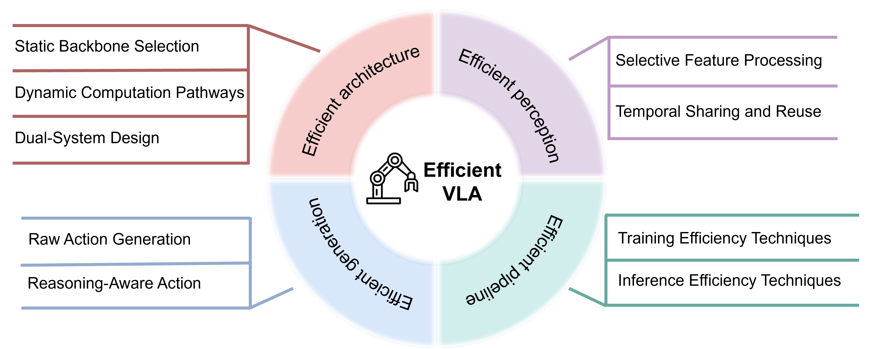

# Awesome-Efficient-VLA [](https://awesome.re)

[](https://arxiv.org/pdf/2510.17111)
[](https://github.com/guanweifan/awesome-efficient-vla/commits/main/)
[](https://github.com/guanweifan/awesome-efficient-vla/pulls)
[](https://github.com/guanweifan/efficient-vla-wiki)

<p align="center">
  
</p>

📖 Survey: A live-updated hub for **[Efficient VLA for Embodied Manipulation](https://arxiv.org/pdf/2510.17111)** across architecture, perception, action & pipeline, providing real-time updates on the fast-moving VLA field.

🚀 Updates: Weekly / Bi-weekly. Contributions & ⭐ are welcome to help researchers navigate the field!

> [!IMPORTANT]
> **✨ Want a more structured way to study this field?**  
> Try [efficient-vla-wiki](https://github.com/guanweifan/efficient-vla-wiki). It turns this paper list into an interactive research workspace where you can ask focused questions, compare methods across papers, and keep building your own understanding of the field.

---

## Quick Navigation

- [Latest Updates](#latest-updates)
- [Efficiency Bottleneck Map](#efficiency-bottleneck-map)
- [Complete Paper List](#complete-paper-list)
- [Related Surveys](#related-surveys)
- [Citation](#citation)
- [Star History](#star-history)
- [Classification Logic](#classification-logic)

## 🔥 Latest Updates (2026-06-23 to 2026-07-06)

- **1.2 Dynamic Computation Pathways:** [DTR](#dynamic-computation-pathways)
- **1.3 Dual-system Design:** [UniFS](#dual-system-design)
- **2.1 Selective Feature Processing:** [ST-Merge](#selective-feature-processing)
- **3.1 Raw Action Generation:** [PolicyTrim](#raw-action-generation)
- **4.1 Training Efficiency Techniques:** [FOCA](#training-efficiency-techniques), [VLM2VLA Parameter Redundancy](#training-efficiency-techniques), [ROAD-VLA](#training-efficiency-techniques), [FORCE](#training-efficiency-techniques)
- **4.2 Inference Efficiency Techniques:** [Embodied.cpp](#inference-efficiency-techniques), [Reasoning-aware Speculative Decoding](#inference-efficiency-techniques)

See the full list in the corresponding sections below.

## Efficiency Bottleneck Map

Start from the efficiency problem you care about, then jump to the corresponding taxonomy section. The complete paper list below keeps code links, venue notes, secondary relevance, and domain tags.

| If you care about... | Go to | Typical signals | Papers |
|---|---|---|---:|
| Smaller model backbone | [1.1 Static Backbone Selection](#static-backbone-selection) | compact VLM, small backbone, lightweight policy | 8 |
| Skipping unnecessary computation | [1.2 Dynamic Computation Pathways](#dynamic-computation-pathways) | routing, layer skipping, early exit, adaptive depth | 9 |
| Slow reasoning with fast control | [1.3 Dual-system Design](#dual-system-design) | dual-system policy, memory, fast controller | 13 |
| Fewer visual tokens | [2.1 Selective Feature Processing](#selective-feature-processing) | pruning, merging, salience selection, compression | 22 |
| Reusing temporal context | [2.2 Temporal Sharing and Reuse](#temporal-sharing-and-reuse) | history fusion, KV cache, feature reuse | 9 |
| Faster action decoding | [3.1 Raw Action Generation](#raw-action-generation) | action tokenizer, chunking, diffusion / flow, parallel decoding | 35 |
| Cheaper reasoning before action | [3.2 Reasoning-Aware Action Generation](#reasoning-aware-action-generation) | text CoT, latent CoT, visual subgoal, world dynamics | 14 |
| Cheaper adaptation or compression | [4.1 Training Efficiency Techniques](#training-efficiency-techniques) | distillation, RL, data selection, PTQ / QAT | 30 |
| Real-time deployment or evaluation | [4.2 Inference Efficiency Techniques](#inference-efficiency-techniques) | streaming, scheduling, edge deployment, metrics | 36 |

---

<a id="complete-paper-list"></a>
## Complete Paper List

Tag notes: `Code` links to an open-source repository; `Venue` marks accepted conference or journal versions; `Sec.` marks secondary relevance; `AD` means autonomous driving; `VLN` means vision-language navigation. Long sections show recent or representative papers first and fold older entries to keep the page scannable.

<a id="efficient-model-architecture"></a>
## 1. Efficient Model Architecture

Reduce structural redundancy inside the model itself through smaller backbones, adaptive computation paths, or slow-fast system decomposition.

<a id="static-backbone-selection"></a>
### 1.1 Static Backbone Selection

- [**Efficient-WAM: A 1B-Parameter World-Action Model with Low-Cost Future Imagination**](https://arxiv.org/pdf/2606.10040) · 🔥 New `2026-06` · Compact video expert with token-sparse future latents and asymmetric video-action denoising. <sub>[Code](https://github.com/jiajun613/Efficient-WAM) · Sec. 3.1</sub>
- [**PokeVLA: Empowering Pocket-Sized Vision-Language-Action Model with Comprehensive World Knowledge Guidance**](https://arxiv.org/pdf/2604.20834) · `2026-04` · Pocket-sized VLA with a lightweight embodied-aware VLM and spatial-semantic guidance.
- [**Evo-1: Lightweight Vision-Language-Action Model with Preserved Semantic Alignment**](https://arxiv.org/pdf/2511.04555) · `2025-11` · Compact multimodal backbone with a cross-modulated diffusion transformer. <sub>[Code](https://github.com/MINT-SJTU/Evo-1) · Sec. 4.1</sub>
- [**FLOWER: Democratizing Generalist Robot Policies with Efficient Vision-Language-Action Flow Policies**](https://arxiv.org/pdf/2509.04996) · `2025-09` · Intermediate-modality fusion with LLM layer pruning. <sub>[Code](https://github.com/intuitive-robots/flower_vla_calvin) · Venue: CoRL 2025</sub>
- [**SmolVLA: A vision-language-action model for affordable and efficient robotics**](https://arxiv.org/pdf/2506.01844) · `2025-06` · Single-GPU training with asynchronous inference. <sub>[Code](https://github.com/huggingface/lerobot) · Sec. 4.2</sub>
- [**NORA: A SMALL OPEN-SOURCED GENERALIST VISION-LANGUAGE ACTION MODEL FOR EMBODIED TASKS**](https://arxiv.org/pdf/2504.19854) · `2025-04` · Qwen-2.5-VL-3B backbone with a FAST+ tokenizer. <sub>[Code](https://github.com/declare-lab/nora)</sub>
- [**TinyVLA: Towards Fast, Data-Efficient Vision-Language-Action Models for Robotic Manipulation**](https://arxiv.org/pdf/2409.12514) · `2024-09` · High-speed multimodal backbone with a diffusion policy decoder. <sub>[Code](https://github.com/liyaxuanliyaxuan/TinyVLA) · Venue: RAL 2025 · Sec. 4.1</sub>
- [**RoboMamba: Efficient Vision-Language-Action Model for Robotic Reasoning and Manipulation**](https://arxiv.org/pdf/2406.04339) · `2024-06` · Mamba state-space backbone for linear-complexity reasoning and efficient inference. <sub>[Code](https://github.com/lmzpai/roboMamba) · Venue: NeurIPS 2024 · Sec. 4.1</sub>

<a id="dynamic-computation-pathways"></a>
### 1.2 Dynamic Computation Pathways

- [**Drop-Then-Recovery: How Redundant Are Vision-Language-Action Models? (DTR / GateProbe)**](https://arxiv.org/pdf/2606.27755) · 🔥 New `2026-06` · Transformer block removal and GateProbe sensitivity ranking for recoverable VLA pruning. <sub>[Code](https://github.com/s1ghhh/VLADrop) · Sec. 4.1</sub>
- [**Finetuning Vision-Language-Action Models Requires Fewer Layers Than You Think (CLP)**](https://arxiv.org/pdf/2606.20246) · 🔥 New `2026-06` · CKA-guided layer pruning before downstream VLA fine-tuning. <sub>Sec. 4.1</sub>
- [**LoopVLA: Learning Sufficiency in Recurrent Refinement for Vision-Language-Action Models**](https://arxiv.org/pdf/2605.09948) · 🔥 New `2026-05` · Recurrent shared-block refinement with learned sufficiency scores for adaptive compute.
- [**Act, Think or Abstain: Complexity-Aware Adaptive Inference for Vision-Language-Action Models (ActThinkAbstain)**](https://arxiv.org/pdf/2603.05147) · `2026-03` · Adaptive routing between direct acting, deeper reasoning, and abstention.
- [**DySL-VLA: Efficient Vision-Language-Action Model Inference via Dynamic-Static Layer-Skipping for Robot Manipulation**](https://arxiv.org/pdf/2602.22896) · `2026-02` · Dynamic-static layer skipping that prioritizes action-critical layers. <sub>[Code](https://github.com/PKU-SEC-Lab/DYSL_VLA) · Sec. 4.1</sub>
- [**Environment-Aware Adaptive Pruning with Interleaved Inference Orchestration for Vision-Language-Action Models (EcoVLA)**](https://arxiv.org/pdf/2602.00780) · `2026-02` · Environment-aware adaptive channel pruning with interleaved orchestration. <sub>Sec. 4.2</sub>
- [**NANOVLA: ROUTING DECOUPLED VISION-LANGUAGE UNDERSTANDING FOR NANO-SIZED GENERALIST ROBOTIC POLICIES**](https://arxiv.org/pdf/2510.25122) · `2025-10` · Lightweight VLA with dynamic routing. <sub>Sec. 1.2</sub>
- [**MoLe-VLA: Dynamic Layer-skipping Vision Language Action Model via Mixture-of-Layers for Efficient Robot Manipulation**](https://arxiv.org/pdf/2503.20384) · `2025-03` · Mixture-of-Layers VLA with a spatial-temporal router. <sub>[Code](https://github.com/RoyZry98/MoLe-VLA-Pytorch) · Venue: AAAI 2026</sub>
- [**DeeR-VLA: Dynamic Inference of Multimodal Large Language Models for Efficient Robot Execution**](https://arxiv.org/pdf/2411.02359) · `2024-11` · Multi-exit MLLM-based VLA with resource-aware early termination. <sub>[Code](https://github.com/yueyang130/DeeR-VLA) · Venue: NeurIPS 2024 · Sec. 4.2</sub>

<a id="dual-system-design"></a>
### 1.3 Dual-system Design

- [**UniFS: Unified Fast-to-Slow Hierarchical Architecture for Vision-Language-Action Models**](https://arxiv.org/pdf/2606.22794) · 🔥 New `2026-06` · Fast-to-slow VLM layer groups with multi-frequency latent routing to the action expert. <sub>[Code](https://github.com/linsun449/UniFS) · Sec. 2.2</sub>
- [**AHA-WAM: Asynchronous Horizon-Adaptive World-Action Modeling with Observation-Guided Context Routing**](https://arxiv.org/pdf/2606.09811) · 🔥 New `2026-06` · Low-frequency world planner with reusable rolling KV context and a high-frequency action executor. <sub>[Code](https://github.com/serene-sivy/AHA-WAM) · Sec. 2.2</sub>
- [**DAM-VLA: Decoupled Asynchronous Multimodal Vision Language Action Model**](https://arxiv.org/pdf/2606.12105) · 🔥 New `2026-06` · Per-modality latent buffers refreshed at native sensor rates for high-frequency action control. <sub>Sec. 2.2</sub>
- [**TacMamba: A Tactile History Compression Adapter Bridging Fast Reflexes and Slow VLA Reasoning**](https://arxiv.org/pdf/2603.01700) · `2026-03` · Tactile history compression for high-frequency tactile control.
- [**StreamVLA: Breaking the Reason-Act Cycle via Completion-State Gating**](https://arxiv.org/pdf/2602.01100) · `2026-02` · Lock-and-gated selective slow reasoning. <sub>Sec. 4.2</sub>
- [**Video2Act: A Dual-System Video Diffusion Policy with Robotic Spatio-Motional Modeling**](https://arxiv.org/pdf/2512.03044) · `2025-12` · Dual-system VLA with slow VDM reasoning. <sub>[Code](https://github.com/jiayueru/Video2Act)</sub>
- [**MEMER: SCALING UP MEMORY FOR ROBOT CONTROL VIA EXPERIENCE RETRIEVAL**](https://arxiv.org/pdf/2510.20328) · `2025-10` · Memory-aware high-level policy selecting keyframes for low-level execution. <sub>Venue: ICLR 2026 · Sec. 2.2</sub>
- [**MOTVLA: A VISION-LANGUAGE-ACTION MODEL WITH UNIFIED FAST-SLOW REASONING**](https://arxiv.org/pdf/2510.18337) · `2025-10` · Mixture-of-Transformers VLA with unified fast-slow reasoning.
- [**Fast-in-Slow: A Dual-System Foundation Model Unifying Fast Manipulation within Slow Reasoning (FiS-VLA)**](https://arxiv.org/pdf/2506.01953) · `2025-06` · Fast execution module inside a VLM-based reasoning model. <sub>[Code](https://github.com/CHEN-H01/Fast-in-Slow) · Venue: NeurIPS 2025</sub>
- [**Hume: Introducing System-2 Thinking in Visual-Language-Action Model**](https://arxiv.org/pdf/2505.21432) · `2025-05` · Value-guided slow thinking with lightweight reactive action denoising. <sub>[Code](https://github.com/hume-vla/hume)</sub>
- [**OPENHELIX: A Short Survey, Empirical Analysis, and Open-Source Dual-System VLA Model for Robotic Manipulation**](https://arxiv.org/pdf/2505.03912) · `2025-05` · Systematic structural evaluation with a low-cost design. <sub>[Code](https://github.com/OpenHelix-Team/OpenHelix)</sub>
- [**TOWARDS SYNERGISTIC, GENERALIZED AND EFFICIENT DUAL-SYSTEM FOR ROBOTIC MANIPULATION (RoboDual)**](https://arxiv.org/pdf/2410.08001) · `2024-10` · Generalist reasoning with a lightweight specialist diffusion policy.
- [**HiRT: Enhancing Robotic Control with Hierarchical Robot Transformers**](https://arxiv.org/pdf/2410.05273) · `2024-10` · Low-frequency VLM reasoning with high-frequency vision-based control. <sub>Venue: CoRL 2024</sub>

<a id="efficient-perception-feature"></a>
## 2. Efficient Perception Feature

Reduce spatial and temporal redundancy in visual representations through token filtering, compression, reuse, or caching.

<a id="selective-feature-processing"></a>
### 2.1 Selective Feature Processing

- [**Fast Enough to Act: Spatio-Temporal Visual Token Merging for Low-Latency Robotic VLMs and VLAs (ST-Merge)**](https://arxiv.org/pdf/2606.29350) · 🔥 New `2026-06` · Training-free 3D spatio-temporal token merging with RoPE-aware positional correction. <sub>[Code](https://github.com/Junzhou-Chen/ST_Merge)</sub>
- [**WAM4D: Fast 4D World Action Model via Spatial Register Tokens**](https://arxiv.org/pdf/2606.14048) · 🔥 New `2026-06` · Training-time spatial register tokens transfer 4D priors without dense geometry decoding at inference. <sub>Sec. 4.1</sub>
- [**LaWAM: Latent World Action Models for Efficient Dynamics-Aware Robot Policies**](https://arxiv.org/pdf/2606.15768) · 🔥 New `2026-06` · Compact latent visual subgoals replace pixel-space future video generation. <sub>[Code](https://github.com/RLinf/LaWAM) · Sec. 3.1</sub>
- [**ImageWAM: Do World Action Models Really Need Video Generation, or Just Image Editing?**](https://arxiv.org/pdf/2606.19531) · 🔥 New `2026-06` · Image-editing KV caches serve as compact world-action context for action prediction. <sub>[Code](https://github.com/yuyangalin/ImageWAM) · Sec. 3.1</sub>
- [**SAFE-Pruner: Semantic Attention-Guided Future-Aware Token Pruning for Efficient Vision-Language-Action Manipulation**](https://arxiv.org/pdf/2605.29662) · 🔥 New `2026-05` · Future-aware visual token pruning using semantic attention consistency across historical keyframes.
- [**See What Matters: Differentiable Grid Sample Pruning for Generalizable Vision-Language-Action Model (GridS)**](https://arxiv.org/pdf/2605.11817) · 🔥 New `2026-05` · Task-aware differentiable grid resampling for compact visual feature selection. <sub>[Code](https://github.com/Fediory/Grid-Sampler)</sub>
- [**One Token Per Frame: Reconsidering Visual Bandwidth in World Models for VLA Policy (OneWM-VLA)**](https://arxiv.org/pdf/2605.07931) · `2026-05` · One latent world token per view/frame for scalable long-horizon rollout.
- [**2D or 3D: Who Governs Salience in VLA Models? Tri-Stage Token Pruning Framework with Modality Salience Awareness**](https://arxiv.org/pdf/2604.09244) · `2026-04` · Tri-stage 2D / 3D token pruning with modality salience awareness.
- [**VLA-InfoEntropy: A Training-Free Vision-Attention Information Entropy Approach for Vision-Language-Action Models Inference Acceleration and Success**](https://arxiv.org/pdf/2604.05323) · `2026-04` · Training-free dynamic token selection using visual entropy, attention entropy, and timestep cues.
- [**VLA-IAP: Training-Free Visual Token Pruning via Interaction Alignment for Vision-Language-Action Models**](https://arxiv.org/pdf/2603.22991) · `2026-03` · Geometric interaction anchors with semantic-motion pruning schedules.
- [**BFA++: Hierarchical Best-Feature-Aware Token Prune for Multi-View Vision Language Action Model**](https://arxiv.org/pdf/2602.20566) · `2026-02` · Hierarchical multi-view token pruning.
- [**Think Proprioceptively: Embodied Visual Reasoning for VLA Manipulation (ThinkProprio)**](https://arxiv.org/pdf/2602.06575) · `2026-02` · Early proprioception fusion for aggressive visual token reduction.

<details>
<summary>More selective feature processing papers</summary>

- [**DTP:A SIMPLE YET EFFECTIVE DISTRACTING TOKEN PRUNINGFRAMEWORK FOR VISION-LANGUAGE ACTION MODELS**](https://arxiv.org/pdf/2601.16065) · `2026-01` · Distracting token pruning. <sub>[Code](https://anonymous.4open.science/r/CBD3)</sub>
- [**Token Expand-Merge: Training-Free Token Compression for Vision-Language-Action Models (TEAM-VLA)**](https://arxiv.org/pdf/2512.09927) · `2025-12` · Dynamic token expansion and merging. <sub>[Code](https://github.com/Jasper-aaa/TEAM-VLA)</sub>
- [**COMPRESSOR-VLA: INSTRUCTION-GUIDED VISUAL TOKEN COMPRESSION FOR EFFICIENT ROBOTIC MANIPULATION**](https://arxiv.org/pdf/2511.18950) · `2025-11` · Hybrid visual token compression with semantic distillation.
- [**VLA-Pruner: Temporal-Aware Dual-Level Visual Token Pruning for Efficient Vision-Language-Action Inference**](https://arxiv.org/pdf/2511.16449) · `2025-11` · Dual-objective visual token pruning. <sub>[Code](https://github.com/MINT-SJTU/VLA-Pruner)</sub>
- [**SemanticVLA: Semantic-Aligned Sparsification and Enhancement for Efficient Robotic Manipulation**](https://arxiv.org/pdf/2511.10518) · `2025-11` · Dual visual pruning with hierarchical fusion. <sub>[Code](https://github.com/JiuTian-VL/SemanticVLA) · Venue: AAAI 2026</sub>
- [**ACTION-AWARE DYNAMIC PRUNING FOR EFFICIENT VISION-LANGUAGE-ACTION MANIPULATION (ADP)**](https://arxiv.org/pdf/2509.22093) · `2025-09` · Action-aware dynamic visual token pruning. <sub>Venue: ICLR 2026</sub>
- [**The Better You Learn, The Smarter You Prune: Towards Efficient Vision-language-action Models via Differentiable Token Pruning (LightVLA)**](https://arxiv.org/pdf/2509.12594) · `2025-09` · Dynamic query-based importance estimation. <sub>[Code](https://github.com/LiAutoAD/LightVLA)</sub>
- [**SpecPrune-VLA: Accelerating VLA Models via Action-Aware Self-Speculative Pruning**](https://arxiv.org/pdf/2509.05614) · `2025-09` · Spatial-temporally consistent action-aware pruning.
- [**FastDriveVLA: Efficient End-to-End Driving via Plug-and-Play Reconstruction-based Token Pruning**](https://arxiv.org/pdf/2507.23318) · `2025-07` · Reconstruction-based foreground-aware pruning. <sub>AD</sub>
- [**Think Twice, Act Once: Token-Aware Compression and Action Reuse for Efficient Inference in VLA Models (FlashVLA)**](https://arxiv.org/pdf/2505.21200) · `2025-05` · Action reuse with information-guided visual token pruning. <sub>Sec. 2.2</sub>
</details>

<a id="temporal-sharing-and-reuse"></a>
### 2.2 Temporal Sharing and Reuse

- [**MemoryWAM: Efficient World Action Modeling with Persistent Memory**](https://arxiv.org/pdf/2606.20562) · 🔥 New `2026-06` · Hybrid persistent memory with recent frames, event anchors, and compact gist tokens for long-horizon WAM context. <sub>Sec. 4.2</sub>
- [**ETA-VLA: Efficient Token Adaptation via Temporal Fusion and Intra-LLM Sparsification for Vision-Language-Action Models**](https://arxiv.org/pdf/2603.25766) · `2026-03` · Temporal fusion plus intra-LLM sparse aggregation for driving inference. <sub>Sec. 2.1 · AD</sub>
- [**Beyond Short-Horizon: VQ-Memory for Robust Long-Horizon Manipulation in Non-Markovian Simulation Benchmarks (VQ-Memory)**](https://arxiv.org/pdf/2603.09513) · `2026-03` · Vector-quantized memory for long-horizon proprioceptive histories.
- [**History-Conditioned Spatio-Temporal Visual Token Pruning for Efficient Vision-Language Navigation (A-MMR)**](https://arxiv.org/pdf/2603.06480) · `2026-03` · Spatio-temporal token pruning for current views and navigation history. <sub>Sec. 2.1 · VLN</sub>
- [**FUTURE-VLA: Forecasting Unified Trajectories Under Real-time Execution**](https://arxiv.org/pdf/2602.15882) · `2026-02` · Temporally adaptive compression for long multi-view histories. <sub>[Code](https://github.com/fan-jj24/FUTURE-VLA)</sub>
- [**Efficient Long-Horizon Vision-Language-Action Models via Static-Dynamic Disentanglement (SD-VLA)**](https://arxiv.org/pdf/2602.03983) · `2026-02` · Static-dynamic token disentanglement with KV reuse.
- [**Learning to Accelerate Vision-Language-Action Models through Adaptive Visual Token Caching**](https://arxiv.org/pdf/2602.00686) · `2026-02` · Task-aware token caching with differentiable selection. <sub>[Code](https://github.com/JiahanFan/LAC) · Sec. 4.2</sub>
- [**KV-Efficient VLA: A Method of Speed up Vision Language Model with RNN-Gated Chunked KV Cache**](https://arxiv.org/pdf/2509.21354) · `2025-09` · Chunk-based KV cache compression with recurrent utility gating.
- [**VLA-Cache: Efficient Vision-Language-Action Manipulation via Adaptive Token Caching**](https://arxiv.org/pdf/2502.02175) · `2025-02` · Visual token KV caching and reuse. <sub>[Code](https://github.com/siyuhsu/vla-cache) · Venue: NeurIPS 2025</sub>

<a id="efficient-action-generation"></a>
## 3. Efficient Action Generation

Reduce redundancy in action representation, decoding, sampling, or reasoning before control.

<a id="raw-action-generation"></a>
### 3.1 Raw Action Generation

- [**PolicyTrim: Boosting Intrinsic Policy Efficiency of Vision-Language-Action Models**](https://arxiv.org/pdf/2606.22540) · 🔥 New `2026-06` · RL post-training improves action chunk utilization and reduces redundant physical execution steps. <sub>[Code](https://github.com/INCEPTIONwang/PolicyTrim) · Sec. 4.1</sub>
- [**TempoVLA: Learning Speed-Controllable Vision-Language-Action Policies**](https://arxiv.org/pdf/2606.06491) · 🔥 New `2026-06` · Speed-conditioned action generation through variable-speed trajectory augmentation.
- [**TBD-VLA: Temporal Block Diffusion Vision Language Action Model**](https://arxiv.org/pdf/2606.07895) · 🔥 New `2026-06` · Block diffusion denoises discrete action tokens in parallel within temporal blocks. <sub>[Code](https://github.com/TBD-VLA/lerobot) · Sec. 4.2</sub>
- [**Light-WAM: Efficient World Action Models with State-Fusion Action Decoding**](https://arxiv.org/pdf/2606.08242) · 🔥 New `2026-06` · Single-forward StateFusionActionExpert with a compact video backbone for efficient WAM action decoding. <sub>[Code](https://github.com/L1ziang/Light-WAM) · Sec. 1.1</sub>
- [**C³ache: Accelerating World Action Models with Cross Inference Chunk Cache**](https://arxiv.org/pdf/2606.08962) · 🔥 New `2026-06` · Cross-chunk action-expert residual reuse at matched denoising steps. <sub>Sec. 2.2</sub>
- [**ReactVLA: Fast and Lightweight Reactive Robot Manipulation via Improved Mean Flow Action Generation**](https://arxiv.org/pdf/2606.14255) · 🔥 New `2026-06` · One-to-few-step Mean Flow action generation with dynamic attention-residual routing. <sub>Sec. 1.2</sub>
- [**Let It Be Simple: One-Step Action Generation for Vision-Language-Action Models (One-Step VLA)**](https://arxiv.org/pdf/2606.05737) · 🔥 New `2026-06` · One-step diffusion / flow-based VLA action generation via high-noise-biased training.
- [**Flash-WAM: Modality-Aware Distillation for World Action Models**](https://arxiv.org/pdf/2606.05254) · 🔥 New `2026-06` · Modality-aware step distillation for single-step video-action generation. <sub>[Code](https://github.com/NU-World-Model-Embodied-AI/Flash-WAM)</sub>
- [**KeyStone: Geometry Guided Self-Consistency for Physical AI**](https://arxiv.org/pdf/2605.08638) · 🔥 New `2026-05` · Training-free inference-time selection that draws parallel candidate action chunks, clusters them in continuous action space, and returns the largest-cluster medoid. <sub>[Code](https://github.com/dywsjtu/keystone) · Sec. 4.2</sub>
- [**Fast-dDrive: Efficient Block-Diffusion VLM for Autonomous Driving**](https://arxiv.org/pdf/2605.23163) · 🔥 New `2026-05` · Section-aligned block diffusion with scaffold speculative decoding for driving outputs. <sub>[Code](https://github.com/NVlabs/Fast-dLLM) · Sec. 4.2 · AD</sub>
- [**BlockVLA: Accelerating Autoregressive VLA via Block Diffusion Finetuning**](https://arxiv.org/pdf/2605.13382) · 🔥 New `2026-05` · Block-diffusion finetuning with parallel denoising and KV-cache reuse. <sub>Sec. 2.2</sub>
- [**CF-VLA: Efficient Coarse-to-Fine Action Generation for Vision-Language-Action Policies**](https://arxiv.org/pdf/2604.24622) · `2026-04` · Coarse-to-fine flow-based action generation with single-step local refinement. <sub>[Code](https://github.com/EmbodiedAI-RoboTron/CF-VLA)</sub>
- [**FASTER: Value-Guided Sampling for Fast RL**](https://arxiv.org/pdf/2604.19730) · `2026-04` · VLA-adjacent value-guided candidate filtering for diffusion-policy sampling. <sub>[Code](https://github.com/alexanderswerdlow/faster)</sub>
- [**SpanVLA: Efficient Action Bridging and Learning from Negative-Recovery Samples for Vision-Language-Action Model**](https://arxiv.org/pdf/2604.19710) · `2026-04` · Flow-matching action expert bridged from autoregressive VLM reasoning. <sub>AD</sub>
- [**SnapFlow: One-Step Action Generation for Flow-Matching VLAs via Progressive Self-Distillation**](https://arxiv.org/pdf/2604.05656) · `2026-04` · Self-distillation from multi-step flow matching to one-step action generation.
- [**Adaptive Action Chunking at Inference-time for Vision-Language-Action Models (AAC)**](https://arxiv.org/pdf/2604.04161) · `2026-04` · Inference-time action chunking using action entropy. <sub>[Code](https://github.com/junhyukso/SGAC)</sub>
- [**AnchorVLA: Anchored Diffusion for Efficient End-to-End Mobile Manipulation**](https://arxiv.org/pdf/2604.01567) · `2026-04` · Anchored diffusion action head with a truncated schedule. <sub>[Code](https://github.com/jason-lim26/AnchorVLA)</sub>

<details>
<summary>More raw action generation papers</summary>

- [**Fast-dVLA: Accelerating Discrete Diffusion VLA to Real-Time Performance**](https://arxiv.org/pdf/2603.25661) · `2026-03` · Block-wise discrete diffusion with KV-cache reuse. <sub>Sec. 4.2</sub>
- [**FASTER: Rethinking Real-Time Flow VLAs**](https://arxiv.org/pdf/2603.19199) · `2026-03` · Horizon-aware flow action sampling. <sub>Sec. 4.2</sub>
- [**ProbeFlow: Training-Free Adaptive Flow Matching for Vision-Language-Action Models**](https://arxiv.org/pdf/2603.17850) · `2026-03` · Adaptive flow solver for redundant decoding evaluations.
- [**Unifying Language-Action Understanding and Generation for Autonomous Driving (LinkVLA)**](https://arxiv.org/pdf/2603.01441) · `2026-03` · Unified language-action codebook with coarse-to-fine decoding. <sub>AD</sub>
- [**Global Prior Meets Local Consistency: Dual-Memory Augmented Vision-Language-Action Model for Efficient Robotic Manipulation (OptimusVLA)**](https://arxiv.org/pdf/2602.20200) · `2026-02` · Retrieved task-level action priors shorten denoising.
- [**ActionCodec: What Makes for Good Action Tokenizers**](https://arxiv.org/pdf/2602.15397) · `2026-02` · Optimization-oriented action tokenizer.
- [**Recurrent-Depth VLA: Implicit Test-Time Compute Scaling of Vision-Language-Action Models via Latent Iterative Reasoning (RD-VLA)**](https://arxiv.org/pdf/2602.07845) · `2026-02` · Recurrent latent refinement with adaptive stopping. <sub>[Code](https://github.com/rd-vla/rd-vla) · Sec. 1.2</sub>
- [**FASTER: TOWARD EFFICIENT AUTOREGRESSIVE VISION LANGUAGE ACTION MODELING VIA NEURAL ACTION TOKENIZATION**](https://arxiv.org/pdf/2512.04952) · `2025-12` · High-compression action tokenizer with block-wise autoregressive decoding. <sub>Venue: ICLR 2026</sub>
- [**MM-ACT: Learn from Multimodal Parallel Generation to Act**](https://arxiv.org/pdf/2512.00975) · `2025-12` · Parallel action decoding. <sub>[Code](https://github.com/HHYHRHY/MM-ACT) · Sec. 4.2</sub>
- [**AsyncVLA: Asynchronous Flow Matching for Vision-Language-Action Models**](https://arxiv.org/pdf/2511.14148) · `2025-11` · Flow matching with action-aware non-uniform scheduling. <sub>[Code](https://github.com/YuhuaJiang2002/AsyncVLA)</sub>
- [**UNIFIED DIFFUSION VLA: VISION-LANGUAGE-ACTION MODEL VIA JOINT DISCRETE DENOISING DIFFUSION PROCESS**](https://arxiv.org/pdf/2511.01718) · `2025-11` · Joint diffusion denoising for image-action generation. <sub>[Code](https://github.com/OpenHelix-Team/UD-VLA) · Venue: ICLR 2026</sub>
- [**OMNISAT: COMPACT ACTION TOKEN, FASTER AUTOREGRESSION**](https://arxiv.org/pdf/2510.09667) · `2025-10` · Residual-quantized action tokenizer.
- [**DISCRETE DIFFUSION VLA: BRINGING DISCRETE DIFFUSION TO ACTION DECODING IN VISION-LANGUAGE-ACTION POLICIES**](https://arxiv.org/pdf/2508.20072) · `2025-08` · Discrete diffusion decoder with adaptive parallel refinement.
- [**NinA: Normalizing Flows in Action. Training VLA Models with Normalizing Flows**](https://arxiv.org/pdf/2508.16845) · `2025-08` · One-shot action sampling with normalizing flows. <sub>[Code](https://github.com/dunnolab/NinA)</sub>
- [**EdgeVLA: Efficient Vision-Language-Action Models**](https://arxiv.org/pdf/2507.14049) · `2025-07` · End-effector prediction with a smaller language model. <sub>[Code](https://github.com/kscalelabs/evla) · Sec. 1.1</sub>
- [**VOTE: Vision-Language-Action Optimization with Trajectory Ensemble Voting**](https://arxiv.org/pdf/2507.05116) · `2025-07` · Low-token action generation with ensemble voting. <sub>[Code](https://github.com/LukeLIN-web/VOTE) · Sec. 4.2</sub>
- [**Real-Time Execution of Action Chunking Flow Policies (RTC)**](https://arxiv.org/pdf/2506.07339) · `2025-06` · Real-time chunking with freeze-and-inpaint. <sub>[Code](https://github.com/LukeLIN-web/VOTE) · Venue: NeurIPS 2025</sub>
- [**FAST: Efficient Action Tokenization for Vision-Language-Action Models**](https://arxiv.org/pdf/2501.09747) · `2025-01` · Frequency-space action tokenization.
</details>

<a id="reasoning-aware-action-generation"></a>
### 3.2 Reasoning-Aware Action Generation

- [**BLUE: Toward Better Language Use in Efficient Vision-Language-Action Models for Autonomous Driving**](https://arxiv.org/pdf/2606.08684) · 🔥 New `2026-06` · Lightweight gate decides when to generate language and when to directly predict actions. <sub>[Code](https://github.com/George-Ling3/BLUE) · Sec. 1.2 · AD</sub>
- [**Think Less, Act Early: Reinforced Latent Reasoning with Early Exit in Vision-Language-Action Models (AVA-VLA)**](https://arxiv.org/pdf/2606.15099) · 🔥 New `2026-06` · RL-denoised latent reasoning with adaptive early exit for lower-latency action prediction. <sub>Sec. 1.2</sub>
- [**Dreaming when Necessary: Advancing World Action Models with Adaptive Multi-Modal Reasoning (AdaWAM)**](https://arxiv.org/pdf/2606.07089) · 🔥 New `2026-06` · Dynamic routing between textual and visual reasoning to reduce unnecessary multimodal reasoning overhead. <sub>Sec. 1.2</sub>
- [**VisualThink-VLA: Visual Intermediate Reasoning for Effective and Low-Latency Vision-Language-Action Policies**](https://arxiv.org/pdf/2605.30011) · 🔥 New `2026-05` · Compact visual-evidence tokens replace high-latency textual CoT for action prediction. <sub>[Code](https://github.com/DCDmllm/VisualThink-VLA) · Sec. 2.1</sub>
- [**VLA-ATTC: Adaptive Test-Time Compute for VLA Models with Relative Action Critic Model**](https://arxiv.org/pdf/2605.01194) · `2026-05` · Uncertainty-triggered deliberation with a Relative Action Critic. <sub>Sec. 4.2</sub>
- [**OneVL: One-Step Latent Reasoning and Planning with Vision-Language Explanation**](https://arxiv.org/pdf/2604.18486) · `2026-04` · One-step latent CoT for single-pass trajectory prediction. <sub>AD</sub>
- [**DualCoT-VLA: Visual-Linguistic Chain of Thought via Parallel Reasoning for Vision-Language-Action Models**](https://arxiv.org/pdf/2603.22280) · `2026-03` · Parallel visual-linguistic Chain-of-Thought.
- [**DynVLA: Learning World Dynamics for Action Reasoning in Autonomous Driving**](https://arxiv.org/pdf/2603.11041) · `2026-03` · Compact future dynamics tokens before action prediction. <sub>AD</sub>
- [**Latent Reasoning VLA: Latent Thinking and Prediction for Vision-Language-Action Models (LaRA-VLA)**](https://www.arxiv.org/pdf/2602.01166) · `2026-02` · Latent reasoning instead of explicit CoT. <sub>[Code](https://github.com/LoveJu1y/LaRA-VLA)</sub>
- [**Fast-ThinkAct: Efficient Vision-Language-Action Reasoning via Verbalizable Latent Planning**](https://arxiv.org/pdf/2601.09708) · `2026-01` · Chain-of-thought distillation for compact reasoning.
- [**LaST0: Latent Spatio-Temporal Chain-of-Thought for Robotic Vision-Language-Action Model**](https://arxiv.org/pdf/2601.05248) · `2026-01` · Latent spatio-temporal CoT. <sub>Sec. 1.3</sub>
- [**Latent Chain-of-Thought World Modeling for End-to-End Autonomous Driving (LCDrive)**](https://arxiv.org/pdf/2512.10226) · `2025-12` · Action-aligned latent chain-of-thought reasoning. <sub>AD</sub>
- [**ThinkAct: Vision-Language-Action Reasoning via Reinforced Visual Latent Planning**](https://arxiv.org/pdf/2507.16815) · `2025-07` · Reinforced visual latent planning. <sub>Venue: NeurIPS 2025 · Sec. 1.3</sub>
- [**Training Strategies for Efficient Embodied Reasoning (ECoT-Lite)**](https://arxiv.org/pdf/2505.08243) · `2025-05` · Robot reasoning recipes for faster CoT-based VLA inference.

<a id="efficient-training-and-inference"></a>
## 4. Efficient Training and Inference

Optimize how VLA models are learned, executed, compressed, deployed, or evaluated.

<a id="training-efficiency-techniques"></a>
### 4.1 Training Efficiency Techniques

#### Adaptation- and Data-Efficient Learning

- [**FORCE: Efficient VLA Reinforcement Fine-Tuning via Value-Calibrated Warm-up and Self-Distillation**](https://arxiv.org/pdf/2606.26006) · 🔥 New `2026-06` · Value-calibrated warm-up and self-distillation stabilize sample-efficient VLA RL fine-tuning.
- [**ROAD-VLA: Robust Online Adaptation via Self-Distillation for Vision-Language-Action Models**](https://arxiv.org/pdf/2606.25800) · 🔥 New `2026-06` · Advantage-guided proximal teacher converts sparse online rewards into dense action-token supervision.
- [**FOCA: Future-Oriented Conditioning for Data-Efficient Vision-Language-Action Adaptation**](https://arxiv.org/pdf/2606.20867) · 🔥 New `2026-06` · Future interaction embeddings and latent future-goal alignment for few-shot VLA adaptation. <sub>[Code](https://github.com/cair-vinuni/FOCA)</sub>
- [**Next Forcing: Causal World Modeling with Multi-Chunk Prediction**](https://arxiv.org/pdf/2606.11187) · 🔥 New `2026-06` · Multi-chunk future prediction modules provide dense causal supervision and parallel future-chunk inference. <sub>[Code](https://github.com/gangweix/next-forcing) · Sec. 3.1</sub>
- [**Potential-Guided Flow Matching for Vision-Language-Action Policy Improvement (ForesightFlow)**](https://arxiv.org/pdf/2606.04968) · 🔥 New `2026-06` · Critic-free flow-matching policy improvement with jointly generated success-potential trajectories.
- [**NVIDIA OmniDreams: Real-Time Generative World Model for Closed-Loop Autonomous Vehicle Simulation**](https://arxiv.org/pdf/2606.03159) · 🔥 New `2026-06` · Real-time action-conditioned world model for scalable closed-loop autonomous-driving simulation. <sub>[Code](https://github.com/nv-tlabs/omni-dreams) · Sec. 4.2 · AD</sub>
- [**EXPO-FT: Sample-Efficient Reinforcement Learning Finetuning for Vision-Language-Action Models**](https://arxiv.org/pdf/2605.25477) · 🔥 New `2026-05` · Online RL fine-tuning with action-chunk editing and Q-guided candidate selection. <sub>[Code](https://github.com/pd-perry/expo-ft/)</sub>
- [**Agentic-VLA: Efficient Online Adaptation for Vision-Language-Action Models**](https://arxiv.org/pdf/2605.22896) · 🔥 New `2026-05` · Agentic online adaptation with reward synthesis, guided exploration, and experience memory.
- [**Learn Where Outcomes Diverge: Efficient VLA RL via Probabilistic Chunk Masking (PCM)**](https://arxiv.org/pdf/2605.16154) · 🔥 New `2026-05` · Outcome-divergent chunk masking for lower VLA RL gradient cost and memory.
- [**FrameSkip: Learning from Fewer but More Informative Frames in VLA Training**](https://arxiv.org/pdf/2605.13757) · 🔥 New `2026-05` · Informative-frame selection for reducing temporal supervision redundancy. <sub>[Code](https://github.com/ZGC-EmbodyAI/FrameSkip)</sub>
- [**D-VLA: A High-Concurrency Distributed Asynchronous Reinforcement Learning Framework for Vision-Language-Action Models**](https://arxiv.org/pdf/2605.13276) · 🔥 New `2026-05` · Distributed asynchronous RL framework for higher VLA training throughput.
- [**VLA-GSE: Boosting Parameter-Efficient Fine-Tuning in VLA with Generalized and Specialized Experts**](https://arxiv.org/pdf/2605.06175) · `2026-05` · Generalized and specialized experts for parameter-efficient VLA fine-tuning. <sub>[Code](https://github.com/YuhuaJiang2002/VLA-GSE)</sub>
- [**Seeing Realism from Simulation: Efficient Video Transfer for Vision-Language-Action Data Augmentation**](https://arxiv.org/pdf/2605.02757) · `2026-05` · Velocity-cached video transfer plus coreset sampling for efficient data augmentation. <sub>[Code](https://github.com/nanfangxiansheng/Seeing-Realism-from-Simulation)</sub>
- [**RL Token: Bootstrapping Online RL with Vision-Language-Action Models (RLT)**](https://arxiv.org/pdf/2604.23073) · `2026-04` · Compact RL token for sample-efficient online actor-critic fine-tuning.
- [**TwinRL-VLA: Digital Twin-Driven Reinforcement Learning for Real-World Robotic Manipulation (TwinRL)**](https://arxiv.org/pdf/2602.09023) · `2026-02` · Digital twin-guided RL for efficient real-world exploration.
- [**RL-VLA3: REINFORCEMENT LEARNING VLA AC-CELERATING VIA FULL ASYNCHRONISM**](https://arxiv.org/pdf/2602.05765) · `2026-02` · Fully asynchronous RL training pipeline.
- [**FT-NCFM: An Influence-Aware Data Distillation Framework for Efficient VLA Models**](https://arxiv.org/pdf/2511.16233) · `2025-11` · Influence-aware generative data distillation. <sub>Venue: AAAI 2026</sub>
- [**VITA-VLA: Efficiently Teaching Vision-Language Models to Act via Action Expert Distillation**](https://arxiv.org/pdf/2510.09607) · `2025-10` · Action expert distillation into a VLM. <sub>[Code](https://github.com/Tencent/VITA)</sub>

#### Distillation and Compression-Oriented Optimization

- [**Revisiting Parameter Redundancy in Vision-Language-Action Models: Insights from VLM-to-VLA Adaptation (VLM2VLA Parameter Redundancy)**](https://arxiv.org/pdf/2606.31382) · 🔥 New `2026-06` · VLM-to-VLA adaptation divergence guides multi-module parameter pruning without post-pruning recovery. <sub>[Code](https://github.com/Niannnnnn/VLA_Parameter_Redundancy_VLM2VLA)</sub>
- [**RT-VLA: Real-Time Vision-Language-Action Models via Knowledge Distillation**](https://arxiv.org/pdf/2606.14010) · 🔥 New `2026-06` · Distills a large autonomous-driving VLA teacher into a compact real-time student. <sub>AD</sub>
- [**Mix-QVLA: Task-Evidence-Aware Mixed-Precision Quantization of Vision-Language-Action Models**](https://arxiv.org/pdf/2606.19565) · 🔥 New `2026-06` · Task-evidence- and time-aware mixed-precision quantization for VLA memory and BitOps reduction.
- [**Ω-QVLA: Robust Quantization for Vision-Language-Action Models via Composite Rotation and Per-step Scaling**](https://arxiv.org/pdf/2605.28803) · 🔥 New `2026-05` · Training-free W4A4 quantization for both the VLA language backbone and diffusion action head. <sub>[Code](https://github.com/UCMP13753/Omega-QVLA)</sub>
- [**ActQuant: Sub-4-bit Action-Guided Quantization for Vision-Language-Action Models**](https://arxiv.org/pdf/2605.24011) · 🔥 New `2026-05` · Action-guided mixed-precision PTQ for sub-4-bit VLA compression and edge deployment. <sub>[Code](https://github.com/arashakb/ActQuant) · Sec. 4.2</sub>
- [**Offline Semantic Guidance for Efficient Vision-Language-Action Policy Distillation (VLA-AD)**](https://arxiv.org/pdf/2605.16241) · 🔥 New `2026-05` · Offline VLM semantic guidance for distilling large VLA teachers into compact students.
- [**DA-PTQ: Drift-Aware Post-Training Quantization for Efficient Vision-Language-Action Models**](https://arxiv.org/pdf/2604.11572) · `2026-04` · Drift-aware PTQ with cross-space compensation and mixed precision.
- [**DyQ-VLA: Temporal-Dynamic-Aware Quantization for Embodied Vision-Language-Action Models**](https://arxiv.org/pdf/2603.07904) · `2026-03` · Dynamic quantization using kinematic sensitivity.
- [**QuantVLA: Scale-Calibrated Post-Training Quantization for Vision-Language-Action Models**](https://arxiv.org/pdf/2602.20309) · `2026-02` · Scale-calibrated PTQ for low-bit deployment. <sub>[Code](https://github.com/AIoT-MLSys-Lab/QuantVLA)</sub>
- [**Shallow-π: Knowledge Distillation for Flow-based VLAs**](https://arxiv.org/pdf/2601.20262) · `2026-01` · Knowledge distillation for reduced-depth flow-based VLA models. <sub>Sec. 1.2</sub>
- [**ActDistill: General Action-Guided Self-Derived Distillation for Efficient Vision-Language-Action Models**](https://arxiv.org/pdf/2511.18082) · `2025-11` · Action-guided distillation with a dynamically routed student. <sub>[Code](https://github.com/gooogleshanghai/ActDistill) · Sec. 1.2</sub>
- [**BitVLA: 1-bit Vision-Language-Action Models for Robotics Manipulation**](https://arxiv.org/pdf/2506.07530) · `2025-06` · Distillation-aware low-bit compression. <sub>[Code](https://github.com/ustcwhy/BitVLA)</sub>

<a id="inference-efficiency-techniques"></a>
### 4.2 Inference Efficiency Techniques

#### Runtime Decoding and Execution

- [**Reasoning-aware Speculative Decoding for Efficient Vision-Language-Action Models in Autonomous Driving**](https://arxiv.org/pdf/2606.31160) · 🔥 New `2026-06` · Routine draft reasoner and full visual target model accelerate chain-of-causation driving reasoning. <sub>Sec. 3.2 · AD</sub>
- [**ElegantVLA: Learning When to Think for Efficient Vision-Language-Action Models**](https://arxiv.org/pdf/2605.29438) · 🔥 New `2026-05` · Phase-adaptive runtime scheduler for recomputation, representation reuse, and denoising-state reuse. <sub>Sec. 3.1</sub>
- [**DEFLECT: Delay-Robust Execution via Flow-matching Likelihood-Estimated Counterfactual Tuning for VLA Policies**](https://arxiv.org/pdf/2605.19294) · 🔥 New `2026-05` · Offline counterfactual tuning for delay-robust asynchronous VLA execution.
- [**Realtime-VLA FLASH: Speculative Inference Framework for Diffusion-based VLAs**](https://arxiv.org/pdf/2605.13778) · 🔥 New `2026-05` · Lightweight draft model and parallel verification for speculative diffusion-VLA inference. <sub>[Code](https://github.com/dexmal/realtime-vla-flash) · Sec. 3.1</sub>
- [**A1: A Fully Transparent Open-Source, Adaptive and Efficient Truncated Vision-Language-Action Model**](https://arxiv.org/pdf/2604.05672) · `2026-04` · Budget-aware adaptive inference for backbone and flow-matching head. <sub>[Code](https://github.com/ATeam-Research/A1)</sub>
- [**StreamingVLA: Streaming Vision-Language-Action Model with Action Flow Matching and Adaptive Early Observation**](https://arxiv.org/pdf/2603.28565) · `2026-03` · Overlaps observation, action generation, and execution. <sub>Sec. 3.1</sub>
- [**HeiSD: Hybrid Speculative Decoding for Embodied Vision-Language-Action Models with Kinematic Awareness**](https://arxiv.org/pdf/2603.17573) · `2026-03` · Hybrid speculative decoding with kinematic boundary selection.
- [**KERV: Kinematic-Rectified Speculative Decoding for Embodied VLA Models**](https://arxiv.org/pdf/2603.01581) · `2026-03` · Kinematic-rectified speculative decoding.
- [**VLA Knows Its Limits (AutoHorizon)**](https://arxiv.org/pdf/2602.21445) · `2026-02` · Dynamic action-horizon adjustment.

<details>
<summary>More runtime decoding and execution papers</summary>

- [**Xiaomi-Robotics-0: An Open-Sourced Vision-Language-Action Model with Real-Time Execution**](https://arxiv.org/pdf/2602.12684) · `2026-02` · Deployment-aligned action chunk rollout. <sub>[Code](https://github.com/XiaomiRobotics/Xiaomi-Robotics-0)</sub>
- [**DynamicVLA: A Vision-Language-Action Model for Dynamic Object Manipulation**](https://arxiv.org/pdf/2601.22153) · `2026-01` · Latent-aware action streaming. <sub>[Code](https://github.com/hzxie/DynamicVLA) · Sec. 1.1</sub>
- [**ActionFlow: A Pipelined Action Acceleration for Vision Language Models on Edge**](https://arxiv.org/pdf/2512.20276) · `2025-12` · Pipelined scheduling with unified KV buffer.
- [**DeeAD: Dynamic Early Exit of Vision-Language Action for Efficient Autonomous Driving**](https://arxiv.org/pdf/2511.20720) · `2025-11` · Action-guided early exit with adaptive layer skipping. <sub>AD</sub>
- [**Spec-VLA: Speculative Decoding for Vision-Language-Action Models with Relaxed Acceptance**](https://arxiv.org/pdf/2507.22424) · `2025-07` · Speculative decoding with relaxed acceptance. <sub>[Code](https://github.com/PineTreeWss/SpecVLA) · Venue: EMNLP 2025</sub>
- [**CEED-VLA: Consistency Vision-Language-Action Model with Early-Exit Decoding**](https://arxiv.org/pdf/2506.13725) · `2025-06` · Multi-token prediction with early-exit decoding. <sub>[Code](https://github.com/OpenHelix-Team/CEED-VLA) · Venue: NeurIPS 2025 · Sec. 4.1</sub>
- [**SP-VLA: A joint model scheduling and token-pruning approach for VLA model acceleration**](https://arxiv.org/pdf/2506.12723) · `2025-06` · Action-aware scheduling with spatio-semantic token pruning. <sub>Venue: ICLR 2026 · Sec. 2.1</sub>
- [**Fast ECoT: Efficient Embodied Chain-of-Thought via Thoughts Reuse**](https://arxiv.org/pdf/2506.07639) · `2025-06` · Reasoning cache reuse and parallel generation. <sub>Venue: ICRA 2026 · Sec. 2.2</sub>
- [**Accelerating VLA Models Integrated with Action Chunking via Parallel Decoding (PD-VLA)**](https://arxiv.org/pdf/2503.02310) · `2025-03` · Fixed-point decoding for action-chunked VLA models.
- [**Fine-Tuning VLA Models: Optimizing Speed and Success (OFT)**](https://arxiv.org/pdf/2502.19645) · `2025-02` · Fine-tuning recipe with parallel decoding and action chunking. <sub>[Code](https://github.com/moojink/openvla-oft) · Venue: RSS 2025</sub>
</details>

#### Deployment, Compression, and Scheduling

- [**Embodied.cpp: A Portable Inference Runtime of Embodied AI Models on Heterogeneous Robots**](https://arxiv.org/pdf/2607.02501) · 🔥 New `2026-07` · Portable C++ runtime with modular multi-rate execution and heterogeneous robot/device adapters. <sub>[Code](https://github.com/SEU-PAISys/Embodied.cpp)</sub>
- [**vla.cpp: A Unified Inference Runtime for Vision-Language-Action Models**](https://arxiv.org/pdf/2606.08094) · 🔥 New `2026-06` · Portable llama.cpp / ggml-based C++ runtime for flow-matching and diffusion VLA inference. <sub>[Code](https://github.com/VinRobotics/vla.cpp)</sub>
- [**Kairos: A Scalable Serving System for Physical AI**](https://arxiv.org/pdf/2605.11381) · 🔥 New `2026-05` · Multi-robot serving system with an execution-aware scheduler that interleaves inference and action execution across a robot fleet to cut end-to-end task latency. <sub>Sec. 3.1</sub>
- [**EdgeFM: Efficient Edge Inference for Vision-Language Models**](https://arxiv.org/pdf/2604.27476) · `2026-04` · Cross-platform edge inference framework with VLA deployment cases.
- [**Characterizing Vision-Language-Action Models across XPUs: Constraints and Acceleration for On-Robot Deployment (DP-Cache / V-AEFusion)**](https://arxiv.org/pdf/2604.24447) · `2026-04` · On-robot XPU characterization with diffusion-step caching and VLM/action-expert pipelining. <sub>Sec. 3.1</sub>
- [**AsyncShield: A Plug-and-Play Edge Adapter for Asynchronous Cloud-based VLA Navigation**](https://arxiv.org/pdf/2604.24086) · `2026-04` · Edge adapter for asynchronous cloud-based VLA navigation under network latency. <sub>VLN</sub>
- [**Realtime-VLA V2: Learning to Run VLAs Fast, Smooth, and Accurate**](https://arxiv.org/pdf/2603.26360) · `2026-03` · Deployment-oriented system with calibration, planning, control, and speed selection. <sub>[Code](https://github.com/dexmal/realtime-vla-v2)</sub>
- [**RAPID: Redundancy-Aware and Compatibility-Optimal Edge-Cloud Partitioned Inference for Diverse VLA Models**](https://arxiv.org/pdf/2603.07949) · `2026-03` · Edge-cloud partitioned inference.
- [**LiteVLA-Edge: Quantized On-Device Multimodal Control for Embedded Robotics**](https://arxiv.org/pdf/2603.03380) · `2026-03` · On-device VLA pipeline with 4-bit quantization. <sub>Sec. 4.1</sub>
- [**HBVLA: Pushing 1-Bit Post-Training Quantization for Vision-Language-Action Models**](https://arxiv.org/pdf/2602.13710) · `2026-02` · Hessian-guided 1-bit binarization.
- [**QVLA: Not All Channels Are Equal in Vision-Language-Action Model's Quantization**](https://arxiv.org/pdf/2602.03782) · `2026-02` · Channel-wise mixed-bit quantization. <sub>[Code](https://github.com/AutoLab-SAI-SJTU/QVLA) · Venue: ICLR 2026</sub>
- [**Don’t Run with Scissors: Pruning Breaks VLA Models but They Can Be Recovered (GLUESTICK)**](https://arxiv.org/pdf/2510.08464) · `2025-10` · Recovery for pruned VLA models.
- [**SQAP-VLA: A Synergistic Quantization-Aware Pruning Framework**](https://arxiv.org/pdf/2509.09090) · `2025-09` · Quantization-aware visual token pruning. <sub>[Code](https://github.com/ecdine/SQAP-VLA) · Sec. 2.1</sub>
- [**EfficientVLA: Training-Free Acceleration and Compression for Vision-Language-Action Models**](https://www.arxiv.org/pdf/2506.10100) · `2025-06` · Layer pruning, visual token selection, and temporal reuse. <sub>Venue: NeurIPS 2025 · Sec. 2.1; 2.2</sub>

#### Efficiency Analysis and Embodied Metrics

- [**Understanding Asynchronous Inference Methods for Vision-Language-Action Models (Async VLA Inference)**](https://arxiv.org/pdf/2605.08168) · 🔥 New `2026-05` · Unified benchmark for asynchronous VLA inference under observation staleness and control delays. <sub>[Code](https://github.com/TheAyos/async-vla-inference)</sub>
- [**From Inference Efficiency to Embodied Efficiency: Revisiting Efficiency Metrics for Vision-Language-Action Models**](https://arxiv.org/pdf/2603.19131) · `2026-03` · System-level analysis of embodied efficiency beyond conventional inference metrics.
- [**How Fast Can I Run My VLA? Demystifying VLA Inference Performance with VLA-Perf**](https://arxiv.org/pdf/2602.18397) · `2026-02` · Analytical performance modeling for real-time VLA inference.

---

<a id="related-surveys"></a>
## Related Surveys

- **[EFFICIENT VISION-LANGUAGE-ACTION MODELS FOR EMBODIED MANIPULATION: A SYSTEMATIC SURVEY](https://arxiv.org/pdf/2510.17111)** *(This work)*
- **[A Survey on Efficient Vision-Language-Action Models](https://arxiv.org/pdf/2510.24795)**

<a id="citation"></a>
## Citation

If you find this survey or resource list helpful, please consider citing our work:

```bibtex
@misc{guan2025efficientvisionlanguageactionmodelsembodied,
      title={Efficient Vision-Language-Action Models for Embodied Manipulation: A Systematic Survey},
      author={Weifan Guan and Qinghao Hu and Aosheng Li and Jian Cheng},
      year={2025},
      eprint={2510.17111},
      archivePrefix={arXiv},
      primaryClass={cs.RO},
      url={[https://arxiv.org/abs/2510.17111](https://arxiv.org/abs/2510.17111)}
}
```

<a id="star-history"></a>
## Star History

[](#fig:starhistory)

<a id="classification-logic"></a>
## Classification Logic

To keep this repository consistent and principled, we classify each paper by its dominant efficiency mechanism: what part of the VLA stack it changes, compresses, reuses, schedules, or evaluates.

The decision tree below is a lightweight diagnostic tool rather than a rigid rule. If a paper spans multiple mechanisms, assign the primary category by the main efficiency bottleneck addressed, and use `Sec.`, `AD`, or `VLN` tags for secondary relevance or domain scope.

This appendix makes the classification transparent and reproducible for future additions to the repository.

```pgsql
START
│
├─ Q1: Is the main intervention the model organization itself?
│      (backbone size, routing depth, slow-fast decomposition)
│      │
│      ├─ Fixed smaller / efficient backbone → 1.1 Static Backbone Selection
│      ├─ Dynamic routing / layer skipping / built-in early exit → 1.2 Dynamic Computation Pathways
│      └─ Slow + fast cooperative policy loops → 1.3 Dual-system Design
│
├─ Q2: Is the main intervention visual or temporal feature processing?
│      │
│      ├─ Spatial token pruning / merging / compression / salience selection
│      │        → 2.1 Selective Feature Processing
│      └─ History fusion / temporal token reuse / KV or feature caching
│               → 2.2 Temporal Sharing and Reuse
│
├─ Q3: Is the main intervention action modeling?
│      │
│      ├─ Action tokenizer, action chunking, diffusion / flow / sampling schedule,
│      │   one-step or parallel action decoder
│      │        → 3.1 Raw Action Generation
│      └─ Text / latent CoT, visual subgoal, world-model reasoning before action
│               → 3.2 Reasoning-Aware Action Generation
│
└─ Q4: Otherwise, is it mainly a learning, compression, deployment, or analysis tool?
       │
       ├─ Training / adaptation / compression-oriented optimization:
       │   PEFT, distillation, data selection, RL fine-tuning, PTQ / QAT calibration
       │        → 4.1 Training Efficiency Techniques
       └─ Runtime / deployment / systems / evaluation:
           speculative or parallel decoding, async / streaming execution,
           pipelining, action reuse, scheduling, edge deployment, metrics
                → 4.2 Inference Efficiency Techniques
```
